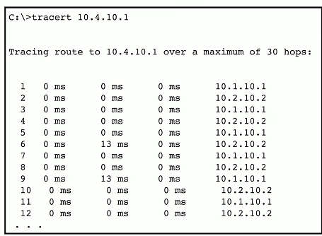
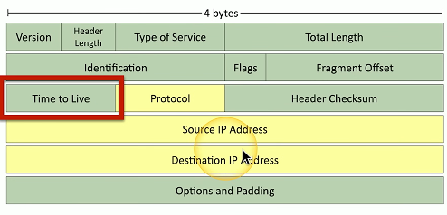
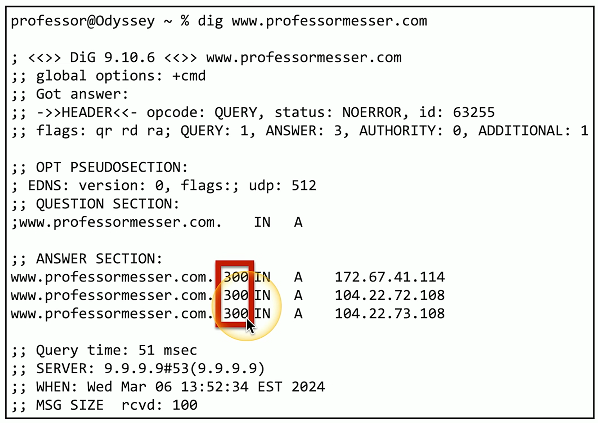

# Networking functions 1.2b
  - There's a lot happening behind the scenes
    - Many networking functions are part of the infrastructure
  - Access to important data
    - From anywhere in the world
  - Remote access
    - Secure networking communication
  - Traffic management
    - Prioritize the important applications
  - Protocol support
    - Maintain uptime and availability
## Content Delivery Network (CDN)
  - It takes time to get data from one place to another
    - Speed up the process
  - Geographically distributed caching servers
    - Duplicated the date
    - Users get the data from a local server
  - You're using a CDN right now 
    - Used on many websites
    - Invisible to the end user
## Virtual Private Network (VPN)
  - Secure private data travsering a public network
    - Encrpyted coummincation on an insecure medium
  - Concentrator/head-end
    - Encrpytion/decryption access device
    - Often integrated into a firewall
  - Many deployment options
    - Specialized cryptographic hardware
    - Software-based options available
  - Often used with client software
    - Sometimes built into the OS
## Quality of Service (QoS)
  - Traffic shaping, packet shaping
  - Control by bandwidth usage or data rates
  - Set important applications to have highjer priorities than other apps
  - Manage the QoS
    - Routers, switches, firewalls, QoS devices

#
## Time to Live (TTL)
  - How long should data be available?
    - Not all systems or protocols are self-regulating
    - We sometimes need to tell a system when to stop
  - Create a timer
    - Wait until traversing a number of hops, or wait until a certain amount of time elapses
    - Then stop or drop
  - Many different uses
    - Drop a packet caught in a loop
    - Clear a cache
## Routing loops
  - Router A thinks the next hop is to Router B
    - Router bB thinks the next hop is to router A
    - Repeat
  - Easy to misconfigure
    - Especially with static routing
  - This can't go on forever
    - TTL is used to stop the loop
  

## IP (Internet Protocol)
  - Loops could cause a packet to live forever
    - Drop the packet after a certain number of hops
  - Each pass through a router is a hop
    - Default TTL for macOS/Linux is 64 hops
    - Default TTL for Windows is 128 hops
  - The routher decreaed TTL by 1
    - A TTL of zero is dropped by the router

## DNS (Domain Name System)
  - DNS lookups
    - Resolve an IP address from a fully-qualified domain name
    - EX: www.professormesser.com IP = 172.67.41.114
  - A device caches the lookup for a certain amount of time 
    - How long? - TTL seconds long.

