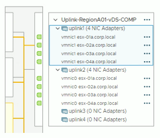

# Designing the Cloud 1.3a
  - On-demand computing power
    - Click of a button
  - Elasticity
    - Scale up or down as needed
  - Applications also scale
    - Scalability for large implementations
    - Access from anywhere
  - Multitenancy
    - Many different clients are using the same cloud infrastructure

## Virtual networks
  - Server farm with 100 individuial computers
    - It's a big farm
  - All servers are connected with enterprise switches and routers
    - With redundancy
  - Migrate 100 physical servesr to one physical server
    - With 100 virtual servers inside
  - What happens to the network?
## Network function virutualization (NFV)
  - Replace physical network devices with virutla versions
    - Manage from the hypervisor
  - Same functionality as a physical device
    - Routing, switching, load balancing, firewalls, etc.
  - Quickly and easily deploy network functions
    - Click and deploy from hypervisor
  - Many different deployment options
    - Virtual machine, container, fault tolerance, etc.
    #

## Connecting to the Cloud
  - Virtual Private Cloud (VPC)
    - A pool of resources created in a public cloud
  - Common to create many VPCs
    - Many different application clouds
  - Connect VPCs with a transit gateway
    - And users to VPCs
    - A "Cloud Router"
  - Now make it secure
    - VPCs are commonly on different IP subnets
    - Connecting to the cloud is often through a VPN
#

- VPN (Virtual Private Network)
  - Site-to-site VPN through the internet
- Virtual Private Cloud Gateway/Internet gateway
  - Connects users on the internet
- VPC NAT gateway
  - Network address translation
  - Private cloud subnets connect to external resources
  - External resources cannot access the private cloud
- VPC Endpoint
  - Direct connection between cloud provider networks

## EXAMPLE: VPC ENDPOINTS

## Security groups and list
  - A firewall for the cloud
    - Control inbound and outbound traffic flows
  - Layer 4 port number
    - TCP or UDP port
  - Layer 3 address
    - Individual addresses
    - CIDR block notation
    - IPv4 or IPv6
#

## Network Security List
  - Assign a security rule to an entire IP subnet
    - Applies to all devices in the subnet
  - Very broad
    - Can be difficult to manage
    - Not all devices in a subnet have the same security posture
  - More granularity may be needed
    - Broad rules may not provide the right level of security
#

## Network Securit Group
  - Assign a security rule to a specfic virtual NIC (VNIC)
    - Applies to specific devices and network connections
  - More granular than network securit lists
    - Different rules for devices in the same IP subnet
  - Better control and granularity
    - The best practice for cloud security rules
#
