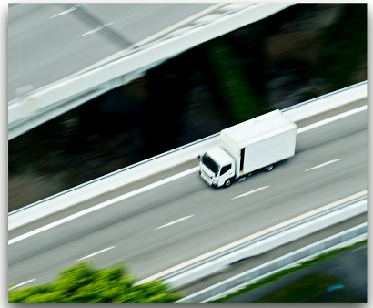
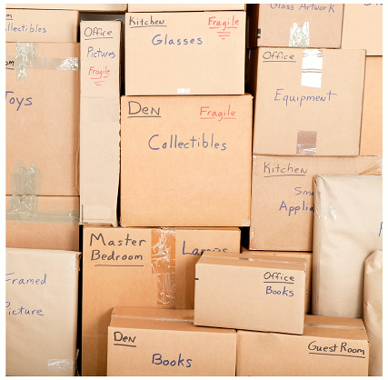

# Intrduction to IP 1.4a
## A series of moving vans
- Efficiently move large amounts of data
  - Using a shipping truck

#

- The network topology is the road
  - Ethernet, DSL, cable system
- The truck is the Internet Protocol (IP)
  - We've designed the roads for this truck
- The boxes hold your data
  - Boxes of TCP and UDP

- Inside the boxes are more things
  - Application information
## IP - Internet Protocol

## TCP and UDP
- Transported inside of IP
  - Encapsulated by the IP protocol
- Two ways to move data from place to place
  - Different features for different applications
- OSI Layer 4:
  - The transport layer
- Multiplexing
  - Use many different applications at the same time
  - TCP and UDP
## TCP - Transmission Control Protocol
- Connection-Oriented
  - A formal connection setup and close
- "Reliable" delivery
  - Recovery from errors
  - Can manage out-of-order messages or retransmissions
- Flow control
  - The receiver can manage how much data is sent

## UDP - User Datagram Protocol
- Connectionless
  - No formal open or close to the connection
- "Unreliable" delivery
  - No error recovery
  - No reordering of data or retransmissions
- No flow control
  - Sender determines the amount of data transmitted

## Speedy Delivery
- The IP delivery truck delivers from one (IP) address to another (IP) address
  - Every house has an address, every computer has an IP address
- Boxes arrive at the house/ IP address
  - Where do the boxes go?
  - Each box has a room name
- Port is written on the outside of the box
  - Drop the box into the right room

## Lots of Ports
- IPv4 Sockets
  - Server IP address, protocol, server application port number
  - Client IP address, protocol, client port number
- Non-emphemeral ports (PERMANENT PORT NUMBERS)
  - Ports 0 through 1,023
  - Usually on a server or service
- Ephemeral ports - (TEMPORARY PORT NUMBERS)
  - Ports 1,024 through 65,535
## Port Numbers
- TCP and UDP ports can be any number between 0 and 65,535
- Most Servers(services)use non-ephemeral(non-temporary) port numbers
  - This isn't always the case
  - It's just a number
- Port numbers are for communication, not security
- Service port numbers need to be "well known"
- TCP port numbers aren't the same as UDP port numbers
## Ports on the Network
- Web server - TCP/80
- VoIP server - UDP/5004
- Email server - TCP/143

## EXAMPLE: IP DATA

