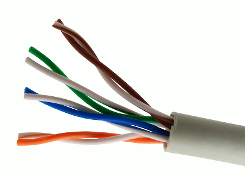

# Copper Cabling 1.5d
## The Importance of cable
- Fundamental to network communication
  - Incredibly important foundation
- Usually only get one good opportunity at building your cabling infrastructure
- The vast majority of wireless communication uses cables
  - Everything eventually touches a cable
## Twisted pair copper cabling
- Balanced pair operation
  - Two wires equal and opposite signals
  - Transmit+, Transmit-/ Receive+, Receive-
- The twist is the secret!
  - Keeps the single wire constantly moving away from the interference
  - The opposite signals are compared on the other end
- Pairs in the same cable have different twist rates
## Cable speeds
- Cables dont have speed
  - The copper just sits there
- Electrical signals are sent over copper cable
  - The signal encoding determines the data transfer rate
- A cable must be manufactured to specific standards
  - IEEE 802.3 Ethernet standards determine the cable type
- Cable standards are described as a "category" of cable
  - EX: Category 6, Category 7, etc.
  - Check the IEEE standard to determine the minimum cable category
  - The minimum cable category for 1000BASE-T is Category 5
## Coaxial cables
- Two or more forms share a common axis

- RG-6 used in television/digital cable
  - and high-speed internet over cable

## Twinaxial cable
- Two inner conductors
  - Twinax
- Common on 10 Gigabit Ethernet SFP+ cables
  - Full duplex
  - Five meters
  - Low cost
  - Low latency compared to twisted pair

## Plenum space

#### Plenum Space
  - Building air circulation
  - Heating and air conditioning system
- Concerns in the case of a fire
  - Smoke and toxic fumes
- Worst-case planning
  - Important concerns for any structure

## No plenum

## Plenum-rated cable
- Traditional cable jacket
  - Polyvinyl chloride (PVC)

- Fire-rated cable jacket
  - Fluorinated ethylene polymer (FEP) or low-smoke polyvinyl chloride (PVC)
- Plenum-rated cable may not be as flexible
  - May not have the same bend radius
- Worst-case planning
  - Used in plenum and risers
  - Important concerns for any structure
#