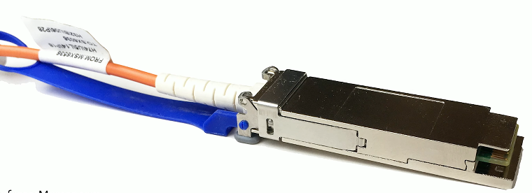
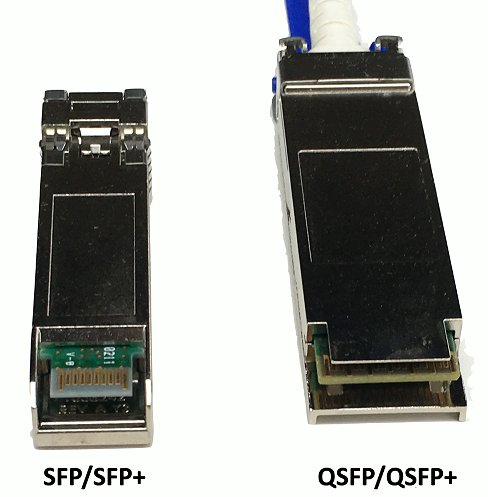

# Network Transceivers 1.5e
## Transceiver
- Transmitter and receiver
  - Usually in a single component
- Provides a modular interface
  - Add the transceiver that matches your network
- Many different types
  - Ethernet or Fibre Channel
  - Not compatible with each other
- Different media types
  - Fiber and copper

## SFP and SFP+
- Small Form-factor pluggable (SFP)
  - Commonly used to provide 1 Gbit/s fiber
  - 1 Gbit/s RJ45 SFPs also available
- Enchanced Small Form-factor Pluggable (SFP+)
  - Exactly the same physical size as SFPs
  - Supports data rates up to 16 Gbit/s
  - Common with 10 Gigabit Ethernet

## QSFP
- Quad Small Form-factor Pluggable
  - 4 Channel SFP = Four 1 Gbit/s = 4 Gbit/s
  - QSFP+ is four-channel SFP+ = Four 10 Gbit/sec = 40 Gbit/sec

# Transceiver Comparison

