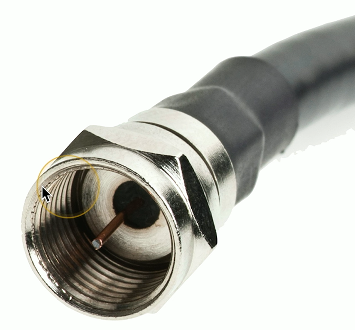

# Copper Connectors 1.5g
## RJ11 Connector

- Registered Jack type 11
  - 6 position, 2 conductor(6P2C)
- Telephone & DSL Connection
## RJ45 Connector
- Registered Jack type 45
- 8 position, 8 conductor (8P8C)
  - Modular connector
  - Ethernet

## F-Connector

- Coaxial cable
  - Standard connector type
  - Threaded connector
- Cable television infrastructure
  - Cable modem
  - DOCSIS (Data Over Cable Service Interface Specification)

- EX: F-connector connecting to modem

## BNC Connector
- Bayonet Neill-Concelman
  - Paul Neill(Bell Labs) and Carl Concelman (Amphenmol)
- Another common coaxial cable connector
  - Common with twinax and DS3 WAN links
  - Video connections

