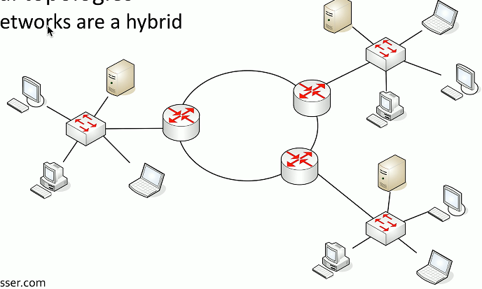

# Network Topologies 1.6a

- Useful in planning a new network
  - Phyiscal layout of a building or campus
- Assits in understanding signal flow
  - Troubleshooting problems

## Star / Hub and spoke

- Used in most large and small networks
- All devices are conencted to a central device
- Switched Ethernet networks
  - The switch is in the middle
## Mesh

- Multiple links to the same place
  - Fully connected
  - Partially connected
- Redundancy, fault-tolerance, load balancing
- Used in wide area networks (WANs)
  - Fully meshed and partially meshed
## Hybrid

- A combination of one or more physical topologies
  - Most networks are a hybrid

## Spine and leaf architecture
- Each leaf switch connects to each spine switch
  - Each spine switch connects to each leaf switch
- Leaf switches do not connect to each other
  - Same for spine switches
- Top-of-rack switching
  - Each leaf is on the "top" of a physical network rack
  - May include a group of physical racks
- Advantages:
  - Simple cabling
  - Redundant
  - Fast
- Disadvantages:
  - Additional switches may be costly

## Point-to-Point
- One-to-one connection
- Older WAN links
  - "Point to point T-1"
- Connections between buildings

