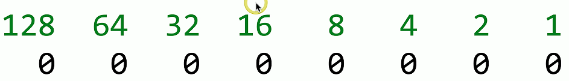
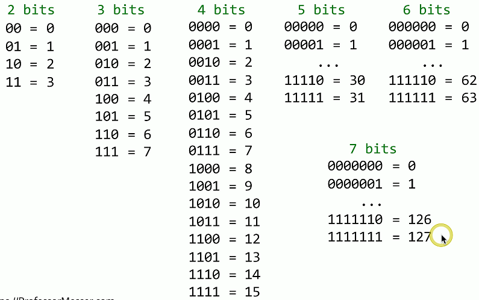

# Binary Math 1.7a
## Basics of Binary Math
- A bit - a zero or a one
  - One digit.
  - Off or on.
  - 0 or 1.
- A byte - Eight bits
  - Often called an "octet" to avoid ambiguity
- A binary-to-decimal coversion chart

#### Example of a binary conversion chart:
### EX 1:

### EX 2:

## Binary to decimal(examples):
#### - What is binary 00000010 in decimal?

#### - What is binary 10000010 in decimal?

#### - What is binary 11111111 in decimal?

#
## Decimal to binary conversion(examples):
#### - What is decimal 154 in binary?

## More bits, more addresses:

## Extending the math
- Powers of two
  - Useful for binary calculations and subnetting

