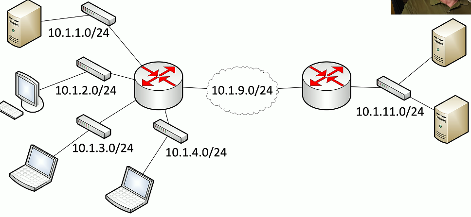
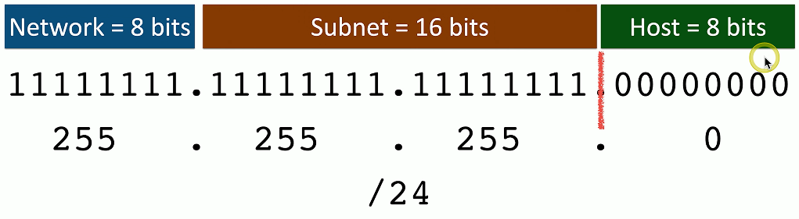

# Calculating IPv4 Subnets and Hosts 1.7e
- Why subnet the network?

## VLSM (Variable Length Subnet Masks)
- Class-based networks are inefficient
  - The subnet mask is based on the network class

- Allow network administrators to define their own masks
  - Customize the subnet mask to specific network requirements
- Use a different subnet masks in the same classful network
  - 10.0.0.0/8 is the class A network
  - 10.0.1.0/24 and 10.0.8.0/26 would be VLSM

## Defining subnets
- IP address: 10.0.0.0
  - Class A, subnet mask: 255.0.0.0
  - "Classful" addressing

### If you were to borrow subnet bits from above:

## Calculating subnets and hosts
- Powers of two

### EX 1:

### EX 2:

### EX 3:
