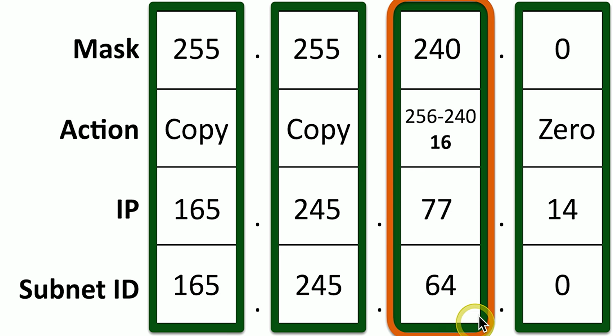
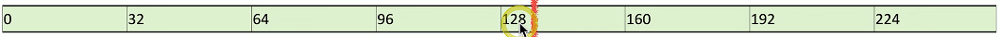

# Magic Number Subnetting 1.7f
## Subnetting the network

## Calculating subnet masks
- We have four networks with about 40 devices per subnet

## Subnetting the network
- IP address 192.168.1.0, subnet mask 255.255.255.192

## Four important addresses
- Network address / subnet ID
  - The first address in the subnet
- Broadcast address
  - The last address in the subnet
- First available host address
  - One more than the network address
### Subnetting the network

## Magic number subnetting
- Very straightforward method
  - Can often perform the math in your head
- Subnet with minimal math
  - Still some counting involved
- Some charts might help
  - But may not be required
  - CIDR to Decimal
  - Host ranges
### Some helpful charts:
- CIDR to decimal charts
  - Memorization will increase speed

### Host Ranges:
- Larger blocks are easier to remember
- Multiply quickly for the smaller blocks

## The magic number process
1. Convert the subnet mask to decimal(if necessary)

2. Identify the "interesting octet"
3. Calculate the "magic number"
    - 256 minus the interesting octet
4. Calculate the host range
5. Identify the network address
    - First address in the range
6. Identify the broadcast address
    - Last address in the range

### Find the subnet ID: (examples)
- IP address: 165.245.77.14
- Subnet mask: 255.255.240.0
1. If the mask is 255, "COPY THE IP ADDRESS"
2. If the mask is zero, "COPY THE ZERO"
3. Anything not 255 or zero is the "INTERESTING OCTET"

4. Subtracting the interesting octet mask from 256 - 240 = 16
5. The magic number is: 16
    - The interesting octet range is: 16
        - Meaning there would be 16 hosts available on that subnet
6. Since 77 is between 64 and 79 you would choose the very first number in the range which would be: 64

### Find the broadcast address:(examples)
- IP address: 165.245.77.14
- Subnet mask: 255.255.240.0
- Subnet ID: 165.245.64.0
  - If the mask is 255, "COPY THE SUBNET ID"
  - If the mask is zero, "WRITE 255"
  - Anything not 255 or zero is the "INTERESTING OCTET"

1. Subtracting the interesting octet mask from 256 - 240 = 16
    - The magic number is: 16
2. Calculate Subnet ID + Magic Number - 1
    - 64 - 16 - 1 = 79

### Find the host range: (examples)
- IP address: 165.245.77.14
- Subnet mask: 255.255.240.0
- Subnet ID: 165.245.64.0
- Broadcast: 165.245.79.255
1. First host is subnet ID + 1
    - 165.245.64.1
2. Last host is broadcast - 1
    - 165.245.79.254
3. All done!

### EX: Finding subnet ID, broadcast address, and host range:
#### Find subnet ID:
- IP address: 10.180.122.244
- Subnet mask: 255.248.0.0
1. Subtract the interesting octet mask from 256
    - 256 - 248 = 8
    - The magic number is: 8
2. Find the starting address of the block of 8

#### Find broadcast address:
- IP address: 10.180.122.244
- Subnet mask: 255.248.0.0
- Subnet ID: 10.176.0.0
1. Subtract the interesting octet mask from 256
    - 256 - 248 = 8
    - The magic number is: 8
2. Calculate Subnet ID + Magic Number - 1
    - 176 + 8 - 1 = 183

#### Find the host range:
- IP address: 10.180.122.244
- Subnet mask: 255.248.0.0
- Subnet ID: 10.176.0.0
- Broadcast: 10.183.255.255

1. First host is subnet ID + 1
    - 10.176.0.1
2. Last host is broadcast - 1
    - 10.183.255.254
- All done!

## Speeding up the magic
- IP address: 172.16.242.133/27
- Subnet mask: 255.255.255.224
- Magic number is 256 - 224 = 32
- Subnet ID: 172.16.242.128
- Broadcast: 172.16.242.159
- First IP address: 172.16.242.129
- Last IP address: 172.16.242.158

