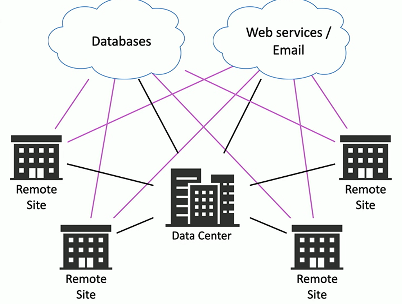

# Software Defined Networking 1.8a
## SDN (Software Defined Networking)
- Networking devices have different functional planes of operation
  - Data
  - Control
  - Management planes
- Split the functions into separate logical units
  - Extend the  functionality and management of a single device
  - Perfectly build for the cloud
- Infrastructure layer / Data plane
  - Process the network frames and packets
    - Forwarding
    - Trunking
    - Encrypting
    - NAT
- Control layer / Control plane
  - Manages the actions of the data plane
  - Routing tables, session tables, NAT tables
  - Dynamic routing protocol updates
- Application layer / Management plane
  - Configure and manage the device
    - SSH
    - Browser
    - API
## Extend the physical architecture

## SD-WAN (Software Defining Networking-Wide Area Network)
- A WAN built for the cloud
- The data center used to be in one place
  - The cloud has changed everything
- Cloud-based applications communicate directly to the cloud
  - No need to hop through a central point

## SD-WAN characteristics
- Application aware
  - The WAN knows which app is in use
  - Makes routing decisions based on the application data
- Zero-touch provisioning
  - Remote equipment is automatically configured
  - Application traffic uses the most optimal path
  - Can change based on traffic patterns and network health
- Transport agnostic
  - The underlying network can be anytype
  - Cable modem, SDL, fiber-based, 5G, etc.
  - Pick the best choice for the location
- Central policy management
  - Management and configuration on a single console
  - One device to configure
  - Changes are pushed to the SD-WAN routers