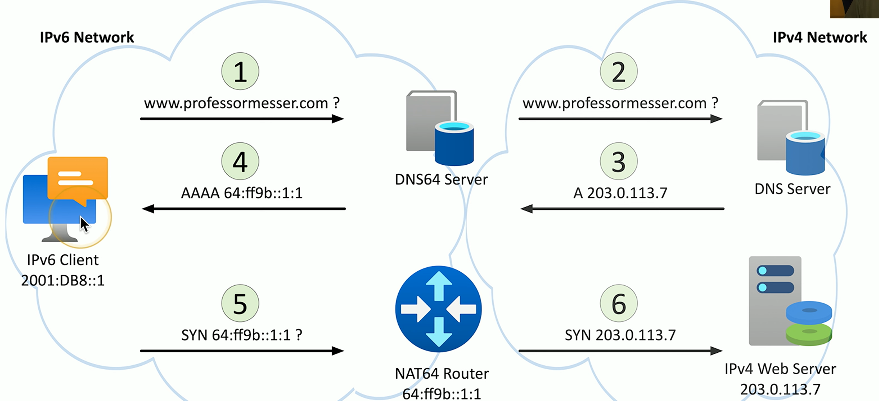

# IPv6 Addressing 1.8e
## IPv4 address exhaustion
- There are an estimated 20 billion devices connected to the Internet(and growing)
  - IPv4 supports around 4.29 billion addresses
- The address space for IPv4 is exhausted
  - There are no available addresses to assign
- IPv4 and NAT is a workaround
  - Can be a challenge with certain protocols
- IPv6 provides a larger address space
  - With room for growth
## IPv6 Addresses
- Internet Protocol v6 - 128-bit address
  - 340,282,366,920,938,463,463,374,607,431,768,211,456 addresses (340 undecillion)
  - Each grain of sand on Earth could have 45 quintillion unique IPv6 addresses

  
## IPv6 Address Compression
- Groups of zeros can be abbreviated with a double color colon
  - Only one of these abbreviations allowed per address
- Leading zeros are optional
### EX 1:

### EX 2:

## Communicating between IPv4 and IPv6
- Not all devices can talk IPv6
  - Legacy devices, embedded systems, etc.
  - How can an IPv4 device talk to an IPv6 server?
  - Can an IPv6 device communicate with a legacy IPv4 server?
- Requires an alternate form of communication
  - Tunnel - Encapsulate one protocol within another
  - Dual-stack - Have the option to use both IPv4 and IPv6
  - Translate - Convert between IPv4 and IPv6
- These are short-term strategies
  - Long-term goal should be a complete migration to IPv6
## Tunneling IPv6
- A migration option
  - Designed for temporary use
- 6 to 4 addressing
  - Send IPv6 over an existing IPv4 network
  - Create an IPv6 address based on the IPv4 address
  - Requires relay routers
  - No support for NAT
  - No longer available as an option in Windows
- 4 in 6 tunneling
  - Tunneling IPv4 traffic on an IPv6 network
## Dual-stack Routing
- Dual-stack IPv4 and IPv6
  - Run both at the same time
  - Interfaces will be assigned multiple address types
- IPv4
  - Configured with IPv4 addresses
  - Maintains an IPv4 routing table
  - Uses IPv4 dynamic routing protocols
- IPv6
  - Configured with IPv6 addresses
  - Maintains a separate IPv6 routing table
  - Uses IPv6 dynamic routing protocols
## Translating between IPv4 and IPv6
- Network address translation using NAT64
  - Translate between IPv4 and IPv6
  - Seamless to the end user
- Requires something in the middle to translate
  - IPv6 is not backwards compatible with IPv4
  - Use a NAT64-capable server
- Works with a DNS64 server
  - Translate the DNS requests
## NAT64
