# Network Address Translation 2.1d
## Network Address Translation (NAT)
- It is estimated that there are over 20 to 30 billion devices connected to the Internet (and growing)
  - IPv4 supports around 4.29 billion addresses
- The address space for IPv4 is exhausted
  - There are no available addresses to assign
- How does it all work?
  - Network Address Translation
- This isn't the only use of NAT
  - NAT is handy in many situations
## Public addresses vs. Private addresses

## NAT EX:
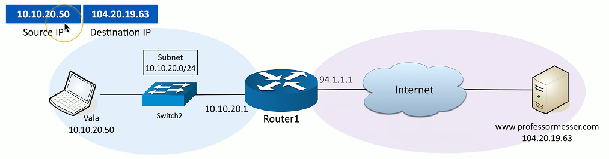

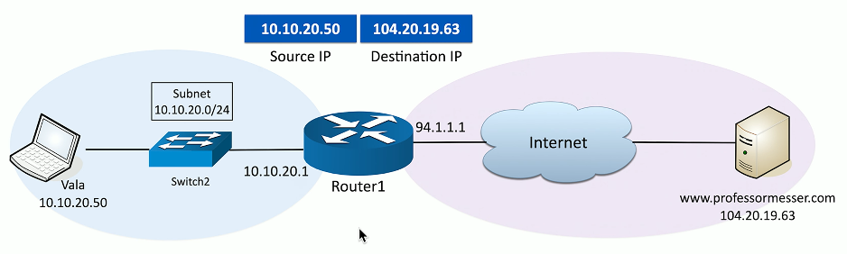

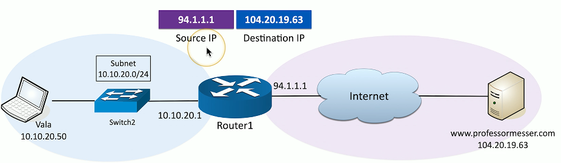

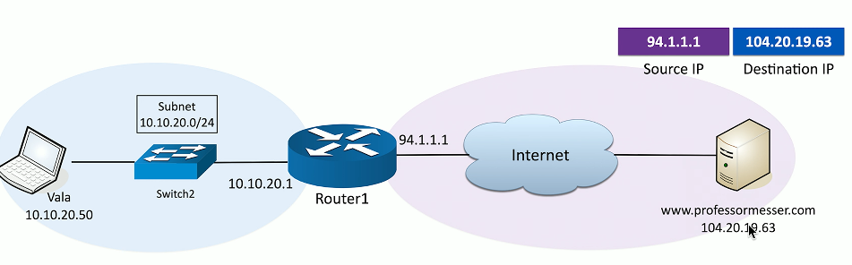

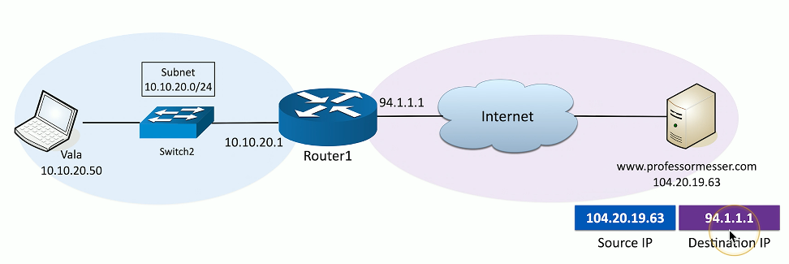

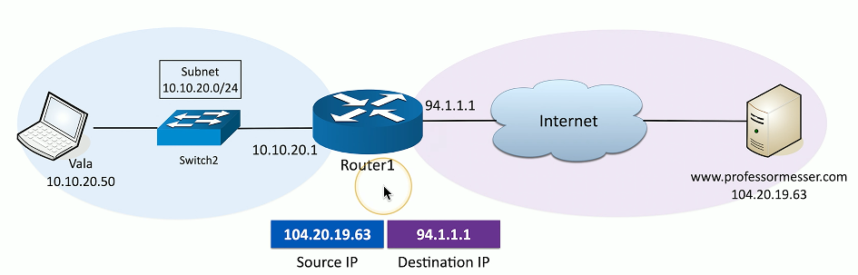

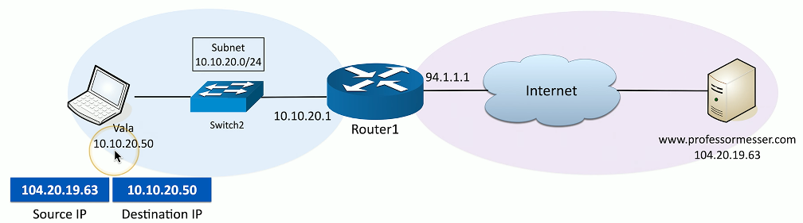

## NAT overload/PAT (Port Address Translation)
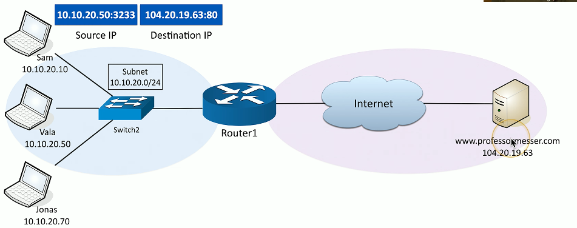

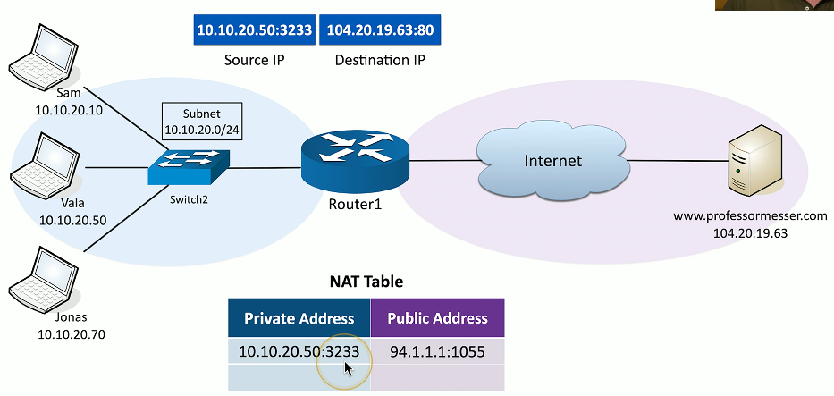

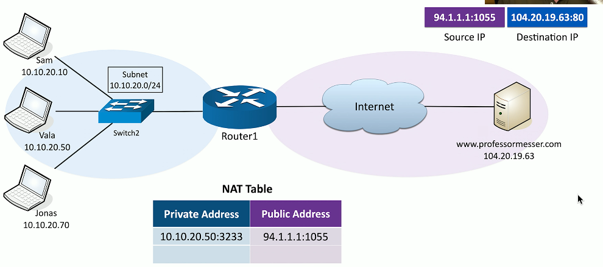

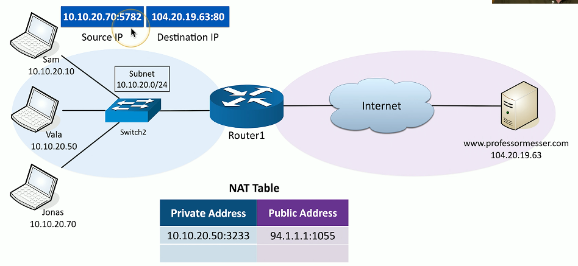

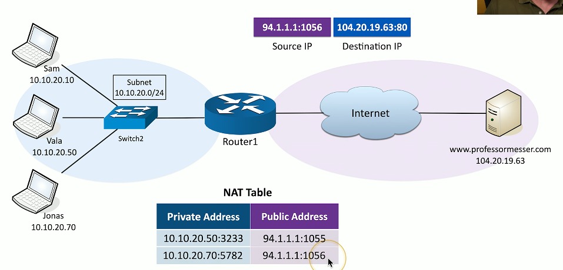