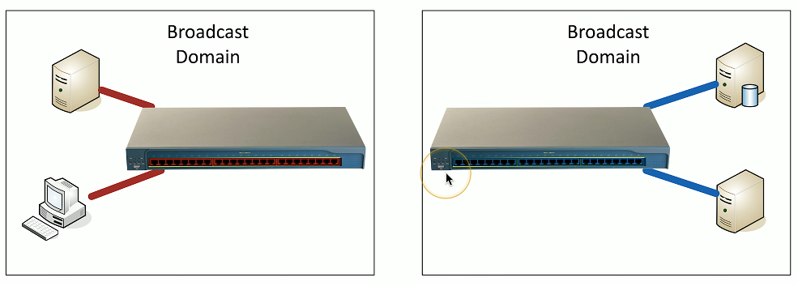
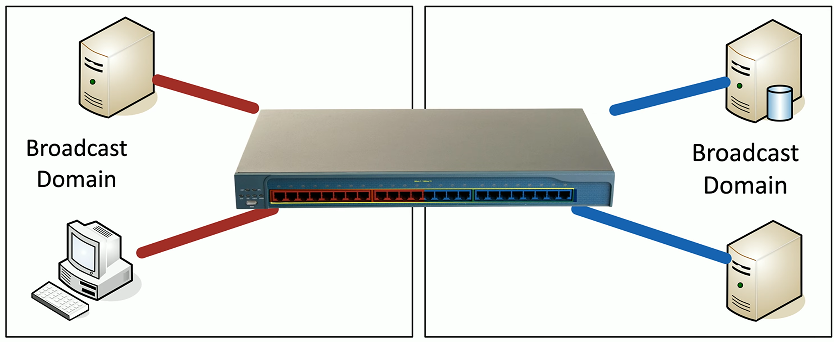
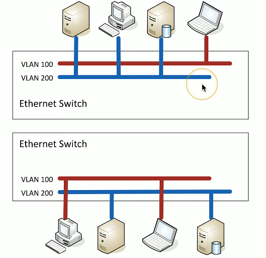
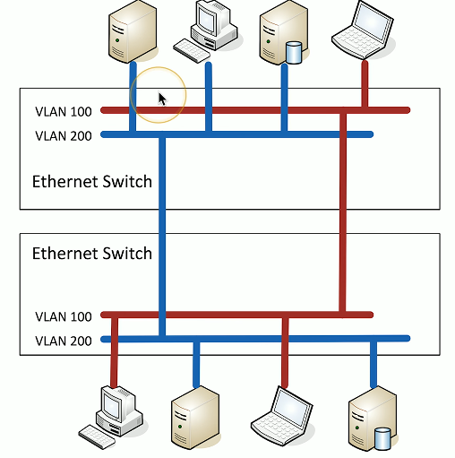
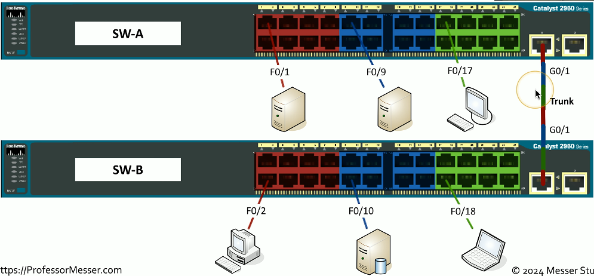

# VLANs and Trunking 2.2a
## LANs
- Local Area Networks
  - A group of devices in the same broadcast domain

 

## Virtual LANs
- Virtual Local Area Networks
  - A group of devices in the same broadcast domain
  - Separated logically instead of physically

## Configuring VLANs

## VLANs on multiple switches

### Connecting an Ethernet cable on both switches

## VLAN trunking

## 802.1Q
- Take a normal Ethernet frame

- Add a VLAN header in the frame

- VLAN IDs - 12 bits long, 4,094 VLANs
  - "Normal range" - 1 through 1,005, "Extended range" - 1,006 through 4,094
  - 0 and 4,095 are reserved VLAN numbers
- Before 802.1Q, there was ISL (Inter-Switch Link)
  - ISL is no longer used: everyone now uses the 802.1Q standard

## Trunking between switches

## The native VLAN
- This is different than the "default VLAN"
  - The default VLAN is the VLAN assigned to an interface by default
- Each trunk has a native VLAN
  - The native VLAN doesn't add an 802.1Q header
- The native VLAN connects switches without a tag
  - Some devices won't talk 802.1Q
  - Just use the native VLAN!
- Native VLAN should match between switches
  - You'll get a message if the VLAN IDs don't match

## Layer 3 switches
- A switch (Layer 2) and router (Layer 3) in the same physical device
  - Layer 2 router?
- Switching still operates at OSI Layer 2, routing still operates at OSI Layer 3
  - There's nothing new or special happening here
- The internal router connects to the VLANs over VLAN interfaces
  - Also called switched virtual interfaces (SVI)
- May need to enable routing on your switch
  - Will operated as an L2 device until enabled
  - May required a switch restart
- Doesn't replace a standalone router
  - Not all designs require extensive routing
  - You probably use a layer 3 switch at home
## Working with data and voice
- Old school: Connect computer to switch, connect phone to PBX (Private Branch Exchange)
  - Two physical cables, two different technologies
- Now: Voice over IP(VoIP)
  - Connect all devices to the Ethernet switch
  - One network cable for both
## Data and voice cabling
- Computer connects to phone
- Phone connects to switch
- One cable, one run

## Just one problem...
- Voice and data don't like each other
  - Voice is very sensitive to congestion
  - Data loves to congest the network
- Put the computer on one VLAN and the phone to another
  - But the switch interface is not a trunk
  - How does that work?
- Each switch interface has a data VLAN and a voice VLAN
  - Configure each of them separately
## Configuring voice and data VLANs
- Data passes as a normal untagged access VLAN
- Voice is tagged with an 802.1Q header
