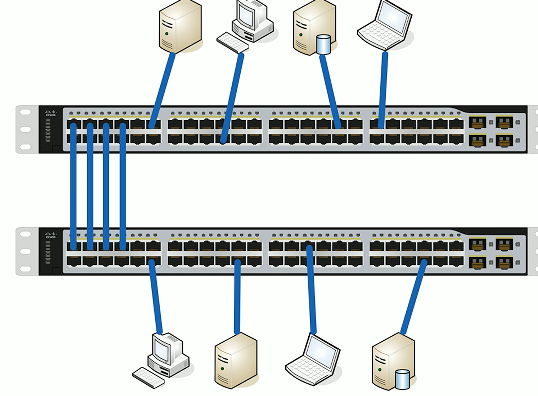
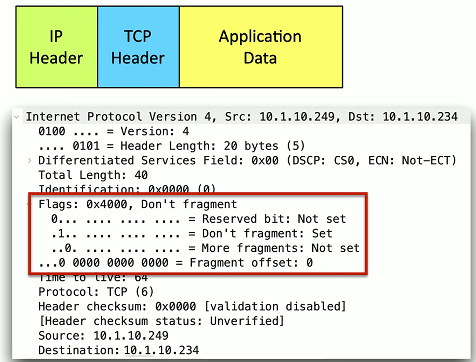

# Interface Configurations 2.2b
## Basic interface configuration
- Speed and duplex
  - Speed: 10/100/1,000/10Gig
  - Duplex: Half/Full
  - Automatic and manual
  - Needs to match on both sides

- IP address management
  - Layer 3 interfaces
  - VLAN interfaces
  - Management interfaces
    - IP address
    - Subnet mask/CIDR block
    - default gateway
    - DNS(optional)
## Link Aggregation
- Port bonding/Link aggregation(LAG)
  - Multiple interfaces act like one big interface
- LACP (Link Aggregation Control Protocol)
  - Adds additional automation and management
  

## Maximum Transmission Unit(MTU)
- Maximum IP packet to transmit 
  - But not fragment
- Framentation slows things down
  - Losing a fragment loses an entire packet
  - Requires overhead along the path
- Difficult to know the MTI all the way through the path
  - Automated methods are often inaccurate
  - Especially when ICMP is filtered
  

## Jumbo frames
- Ethernet frames with more than 1,500 btyes of payload
  - Up to 9,216 bytes of an MTU(9,000 is the accepted norm)
- Increases transfer efficiency
  - Per-packet size
  - Fewer packets to switch/route
- Ethernet devices must support jumbo frames
  - Switches
  - Interface cards
    - Not all devices are compatible with others
