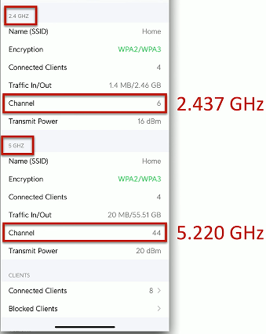
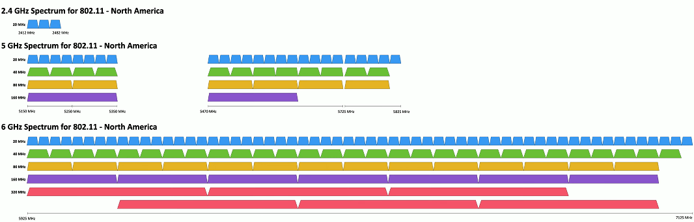

# Wireless Technologies 2.3a
## Wireless technologies
- IEEE standards
  - Institute of Electrial and Electronics Engineers
  - 802.11 committee
  - Everyone folows these standards
- Also referenced as a generation
  - 802.11ac is Wi-Fi 5
  - 802.11ax is Wi-Fi 6 and not Wi-Fi 6E(extended)
  - 802.11be is Wi-Fi 7
  - Future versions will increment accordingly
## 802.11 Technologies
- Frequencies
  - 2.4 Ghz, 5 GHz, and 6 GHz
  - Sometimes a combination
- Channels
  - Groups of frequencies, numbered by the IEEE
  - Using non-overlapping channels would be optimal
  

- Bandwidth
  - Amount of frequency is use
  - 20 MHz, 40 MHz, 80 Mhz, 160 Mhz
### Band selection and bandwidth

## Band steering
- Many frequencies to choose from
  - Not all of them are optimal
- Some devices may only use one frequency
  - Older devices, specialized systems, etc.
- Other devices may have a choice
  - 2.4 GHz, 5 GHz, or 6 GHz
- Use band steering to direct clients to the best frequency
  - 2.4 GHz and 5 GHz without band steering = strongest frequency
  - 2.4 GHz and 5 GHz without band steering = 5 GHz connection
## Regulatory Impacts
- Managing the wireless spectrum is a challenge
  - Individuals
  - Companies
  - Organizations
  - Countries
- The world is constantly changing
  - Frequency allocations can be fluid
- Industry standard are also often worldwide standards
  - We all have to work together
- IEEE 802.11h standard
  - Add interoperability features to 802.11
## The 802.11h standard
- 802.11 wireless complies with ITU guidelines
  - A worldwide approach
  - Now part of the 802.11 standard
- DFS (Dynamic Frequency Station)
  - Avoid frequency conflict
  - Access point can switch to an unused frequency
  - Clients move with the access point
- TPC (Transmit Power Control)
  - Avoid conflict with satellite services
  - Access point determines power output of the client