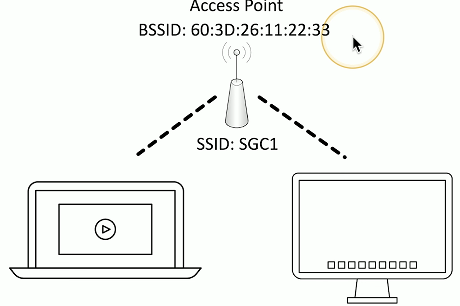
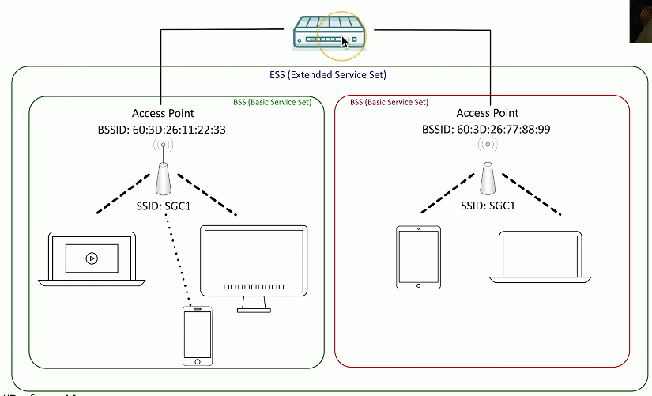
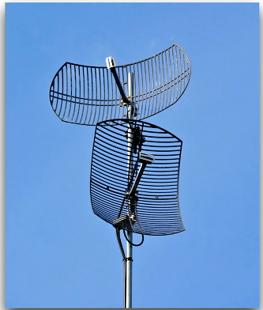
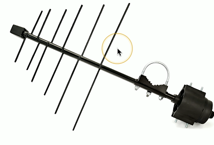
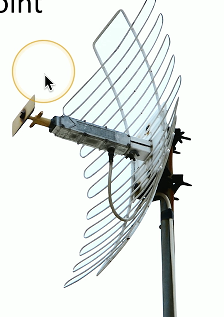

# Wireless Networking 2.3b
## Independent basic service sett (IBSS)
- Two devices communicate directly to each other using 802.11
  - No access point required
- Ad hoc
  - Created for a particular purpose without any previous planning
    - Without an AP
- Temporary or long-term communication
  - Connect to a device with an ad hoc connection
  - Configure it with the access point settings and credentials
  

## SSID and BSSID
- Every wireless network needs a name
  - SSID (Service Set Identifier)
- There might be multiple access points supporting an SSID
  - How does your computer tell them apart?
  - The hardware address of an access point is a BSSID (Basic Service Set Identifier)
  - The MAC (Media Access Control) address
  

## Extending the network
- Most organizations have more than one access point
  - Tens or hundreds
- Wireless network names can be used across access points
  - Makes its easier to roam from one part of the network to another
- The network name shared accross access points is an ESSID
  - Extended Service Set Identifier
- Your device automatically roams when moving between access points
  - You don't have to manually reconnect
### ESSID Diagram:

## Captive Portal
- Authentication to a network
  - Common on wireless networks
- Access table recognizes a lack of authentication
  - Redirects your web access to a captive portal page
- Username/password
  - And additional authentication factors
- Once proper authetication is provided, the web session continues
  - Until the captive portal removes your access

## Wireless security modes
- Configure the authentication on your wireless access point/wireless router
- Open System
  - NO authentication password is required

  

- WPA/2/3-Personal/WPA/2/3-PSK
  - WPA2 or WPA3 with a pre-shared key
  - Everyone uses the same 256-bit key
- WPA/2/3-Enterprise/WPA/2/3-802.1X
  - Authenticates users individually with an authentication server
    - EX:
      - RADIUS
      - LDAP
## Omnidirectional antennas
- One of the most common
  - Included on most access points
- Signal is evenly distributed on all sides
  - Omni = All
- Good choice for most environments
  - You need coverage in all directions
- No ability to focus the signal
  - A differnt antenna will be required

## Directional antennas
- Focus the signal
  - Increased distances
- Send and receive in a single direction
  - Focused transmission and listening
- Antenna performance is measured in dB
  - Double power every 3dB of gain

### More examples:
- Yagi antenna
  - Very directional and high gain

  

- Parabolic antenna
  - Focus the signal to a single point

  

## Managing wireless configurations
- Autonomoous access points
  - The access point handles most wireless tasks
  - The switch is not wireless-aware
- Lightweight access points
  - Just enough to be 802.11 wireless
  - The intelligence is in the swithc
  - Less expensive
- Control and provision
  - CAPWAP is an RFC standard
    - Control and Provisioning of Wireless Access Points
    - Manage multiple access point simultaneously
## Wireless LAN controllers
- Centralized management of access points
  - Single "pane of glass"
- Deploy new accesss points
- Performance and security monitoring
- Configure and deploy changes to all sites
- Report on access point use
- Usually a proprietary system
  - The wireless controller is paired with the access points
