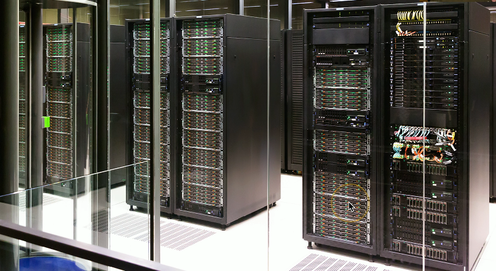
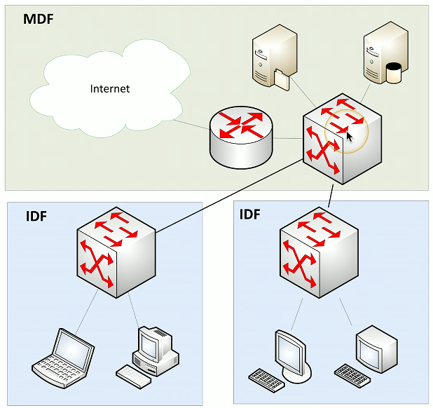
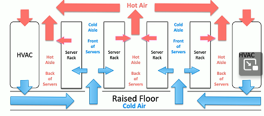

# Installing Networks 2.4a
## Distribution frames
- Passive cable termination
  - Punch down blocks
  - Patch panels
- Usually mounted on the wall or flat surface
  - Uses a bit of real-estate
- All transport media
  - Copper
  - Fiber
  - Voice and data
- Often used as a room or location name
  - It's a significant part of the network
## Main Distribution Frame(MDF)
- Central point of the network
  - Usually in a data center
- Termination point for WAN links
  - Connects the inside to the outside
- Good test point
  - Test in both directions
- This is often the data center 
  - The central point for data
  

## Intermediate Distribution Frame(IDF)
- Extension of the MDF
  - A strategic distribution point
- Connects the users to the network
  - Uplinks from the MDF
  - Workgroup switches
  - Other local resources
- Common in medium to large organizations
### Diagram:

## Equipment racks
- Rack sizes
  - 19" rack/device width
- Height measured in rack units
  - 1U is 1.75"
  - A common rack height is 42U
- Depth can vary
  - Often determined by the equipment
- Plan and locate
  - Devices follow standard sizing
## Cooling a data center
- Heating, Ventilating, and Air Conditioning
  - Thermodynamics, fluid mechanics, and heat transfer
- Complex science
  - Not something you can properly design yourself
  - Must be integrated into the fire system
- Data centers optimize cooling
  - Separate aisles for heating and cooling
- Heat intake and exhaust is important
  - Front, back, or side

  

  ## Cable Infrastructure
  

## Copper patch panel/patch bay
- Punch-down block on one side
  - RJ45 connector on the other
- Move a connection around
  - Different switch interfaces
- The run to the desk doesn't move

## Fiber distribution panel
- Permanent fiber installation
  - Patch panel at both ends
- Fiber bend radius
  - Breaks when bent too tightly
- Often includes a service loop
  - Extra fiber for future changes
  - Inexpensive insurance
  
## Locking Cabinets
- Data center hardware is usually managed by different groups
  - Responsibility leis with the owner
- Racks can be installed together 
  - Side-to-side
- Enclosed cabinets with locks
  - Ventilation on front, back, top, and bottom

  