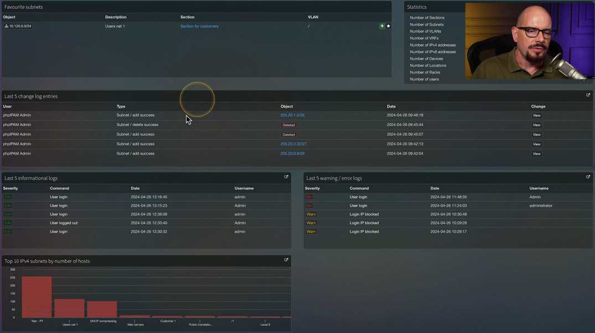
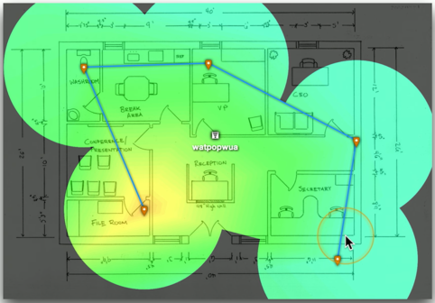

# Network Documentation 3.1a
## Physical network maps
- Follows the physical wire and device
  - Can include physical rack locations
### EX:

## Logical network maps
- Specialized software
  - Visio
  - OmniGraffle
  - Gliffy.com
- High-level views
  - WAN layout
  - Application flow
- Useful for planning and collaboration

## Rack diagram

- A network admin might never walk into the data center

  - Physical access is often limited
- Provide documentation for installion or changes
  - A picture is worth a thousands words
- Detail diagram of rack components
  - Often listed by physical location of the rack (ex: row 3, rack W)
  - Each rack unit(U) is documented

## Cable maps and diagrams
- The foundation of the network
  - Physical cable and fiber
- Valuable documentation
  - Planning the installation
  - Numbering each network drop
  - Troubleshooting after installation
### EX:

## Network diagrams

## Asset management
- A record of every asset
  - Laptops
  - Desktops
  - Servers
  - Routers
  - Switches
  - Cables
  - Fiber modules
  - Tablets
  - ETC.
- Associate support tickets with a device make and model
  - A record of hardware and software
- Financial records, audits, depreciation
  - Make/model, configuration, purchase date, location, etc.
- Add an asset tag
  - Barcode
  - RFID
  - Visible tracking number
  - Organization name
## Asset database
- A central asset tracking system
  - Used by different parts of the organization
- Assigned users
  - Associate a person with an asset
  - Useful for tracking a system
- Warranty
  - A different process if out of warranty
- Licensing
  - Software costs
  - Ongoing renewal deadlines
## IP Address Management (IPAM)
- Manage IP addressing
  - Plan
  - Track
  - Configure DHCP
- Report on IP address usage
  - Time of day, user-to-IP mapping
- Control DHCP reservations
  - Identify problems and shortages
- Manage IPv4 and IPv6
  - One console
    - EX:

    

## Service level agreement (SLA)
- SLA
  - Minimum terms for service provided
  - Uptime, response time agreement, etc.
  - Commonly used between customers and service providers
- Contract with an Internet provider
  - SLA is no more than four house of unscheduled downtime
  - Technician will be dispatched
  - May require customers to keep spare equipment on-site
## Site surveys
- Determine existing wireless landscape
  - Sample the existing wireless spectrum
- Identify existing access points
  - You may not control all of them
- Work around existing frequencies
  - Layout and plan for interference
- Plan for ongoing site surveys
  - Things will certainly change
- Heat maps
  - Identify wireless signal strengths
  - EX:
  
  