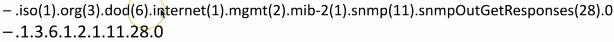

# SNMP 3.2a
## SNMP

- Simple Network Management Protocol
  - A database of data (MIB) - Management Information Base
  - The database contains OIDs - Object Identifiers
  - Poll devices over udp/161

- SNMP v1 - The Original
  - Structured tables
  - In-the-clear
- SNMP v2c - A good step ahead
  - Data type enchancements
  - Bulk transfers
  - Still in-the-clear
- SNMP v3 - The new standard
  - Message integrity
  - Authentication
  - Encryption

## SNMP OIDs
- An object identifier can be referenced by name or number

- Every variable in the MIB has a corresponding OID
  - Some are common across devices
  - Some manufacturers define their own object identifiers
- The SNMP manager requests information based on OID
  - A consistent reference across devices
## Walking the SNMP MIB
### EX 1:

### EX 2:

## Graphing with SNMP

## SNMP Traps
- Most SNMP operations expect a poll
  - Devices then respond to the SNMP request
  - This requires constant polling
- SNMP traps can be configured on the monitored device
  - Communicates over udp/162
- Set a threshold for alerts
  - If the number of CRC errors increases by 5, send a trap
- Monitoring station can react immediately
## Authentication
- Community string
  - A simple password-style authentication method
  - Read-only
  - Read-write
  - Trap
  - Common community string are public and private
  - Used with SNMP v1 and SNMP v2c