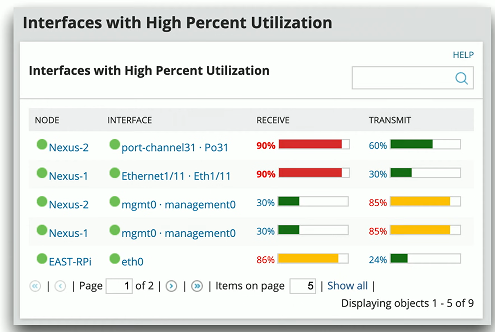

# Network Solutions 3.2c
## Network discovery
- Difficult to see beyond the wall jack
  - LLDP (Link Layer Discovery Protocol)
  - CDP (Cisco Discovery Protocol)
  - IP scanners (Nmap)
  - Commercial network scanners
  - SNMAP

  

- Ad hoc
  - Scan as needed or required
- Scheduled
  - Scan occurs at regular intervals
  - Report on moves, adds, and changes
## Traffic analysis
- View traffic information from routers, switches, firewalls, etc.
  - Identify traffic flows
  - View traffic summaries
- Can be very detailed
  - Every flow from every device
- Important historical information
  - Monitoring, post-event analysis

## Performance monitoring
- The fundamental network statistic
  - Amount of network use over time
- Many different ways to gather this metric
  - SNMP
  - NetFlow
  - Protocol analysis
  - Software agent
- Identify fundamentals issues
  - Nothing works properly if bandwidth is highly utilized
  
## Availability monitoring

 

- Up or down
  - The most important statistic
  - No special rights or permissions required
  - Green is good
  - Red is bad
- Alarming and alerting
  - Notification should an interface fail to report
  - Email
  - SMS
- Short-term and long-term reporting
  - View availability over time
- Not focused on additional details
  - Additional monitoring may require SNMP
## Network device backup and restore
- Every device has a configuration
  - IP addresses
  - Security settings
  - Port configurations
  - Most devices allow the configurations to be downloaded and uploaded
  - COnfigurations may be specific to a version of operating code or firmware
- Revert to a previous state
  - Use backups to return to a previous configuration date and time
  - May require a firmware or version downgrade
## Configuration monitoring
- Ten identical web servers
  - Should have ten identical configurations
  - How to confirm?
- Monitor the configurations
  - Verify consistency
  - Alert on any changes
  - Backup and restore
- Often part of a larger management system or strategy
  - Central console and access
  
