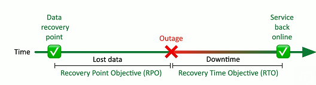

# Disaster Recovery 3.3a
## Disaster recovery plan (DRP)
- Detailed plan for resuming operations after a disaster
  - Application
  - Data center
  - Building
  - Campus
  - Region
  - ETC.
- Extensive planning prior to the disaster
  - Backups
  - Off-site data replication
  - Cloud alternative
  - Remote site
- Many third-party options
  - Physical locations
  - Recovery services
### Recovery Time Objective (RTO)
- Measured as an amount of time
  - Time to resume operations
  - We would like this to be near-zero
- RTO
  - Get up and running quickly
  - Get back to a particular service level in a certain timeframe

### Recovery Point Objective (RPO)
- RPO
  - Also measured as an amount of time
    - The goal is have a near-zero RPO
  - How much data loss is acceptable?
  - Bring the system back online; how far back in time does data go?
- Define the right RPO
  - Banking transactions, patient information
    - Very short - less than an hour
  - Website updates, internal documents
    - 1-4 hours

  

## MTTR and MTBF
- Mean time to Repair (MTTR)
  - Average time required to fix the issue
  - The time from the point of the failure to full functionality
- Mean time between failures (MTBF)
  - Predict the time between outages
  - Often takes many variables into account
## Site resiliency
- Recovery site is prepped
  - Data is sychronized
- A disaster is called
  - Business processes failover to the alternative processing site
- Problem is addressed
  - This can take hours, weeks, or longer
- Revert back to the primary location
  - The process must be documented for both directions
### Cold site
- No hardware
  - Empty building
- No data
  - Bring people with you
- No people
  - Bus in your team
### Hot site
- An exact replica
  - Duplicate everything
- Stocked with hardware
  - Constantly updated
  - You buy two of everything
- Applications and software are constantly updated
  - Automated replication
- Flip a switch and everything moves
  - This may be quite a few switches
### Warm site
- Somewhere between cold and hot
  - Just enough to get going
- Big room with rack space
  - You bring the hardware
- Hardware is ready and waiting
  - You bring the software and data

## Tabletop exercise
- Performing a full-scale disaster drill can be costly
  - And time consuming
- Many of the logisitics can be determined through analysis
  - You don't physically have to go through disaster or drill
- Get key players together for a tabletop exercise
  - Talk through a simulated disaster
## Validation tests
- Test yourselves before an actual event
  - Scheduled update session
    - Annual
    - Semi-annual
    - ETC.
- Use well-defined rules of engagement
  - Do not touch the production systems
- Very specific scenario
  - Limited time to run the event