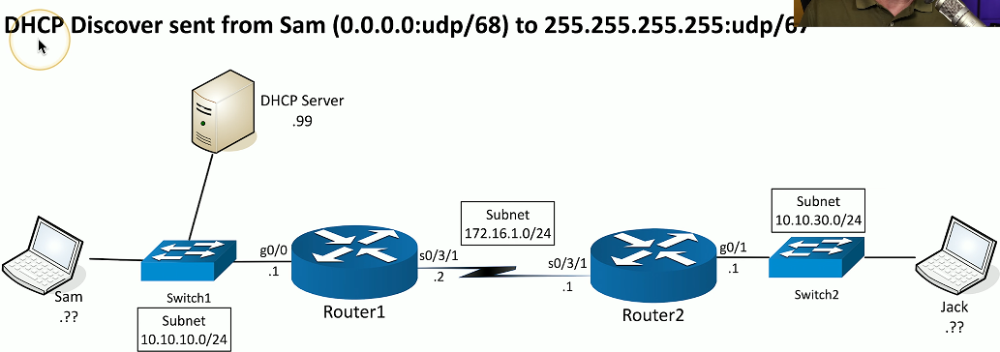
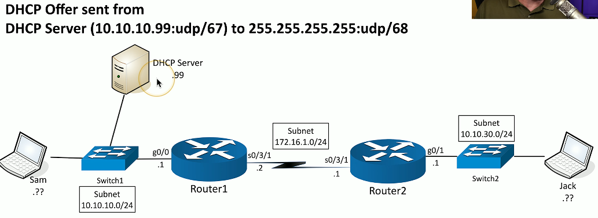
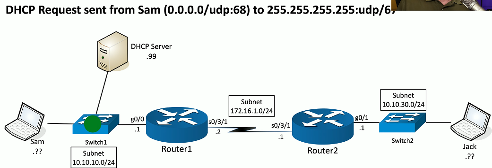
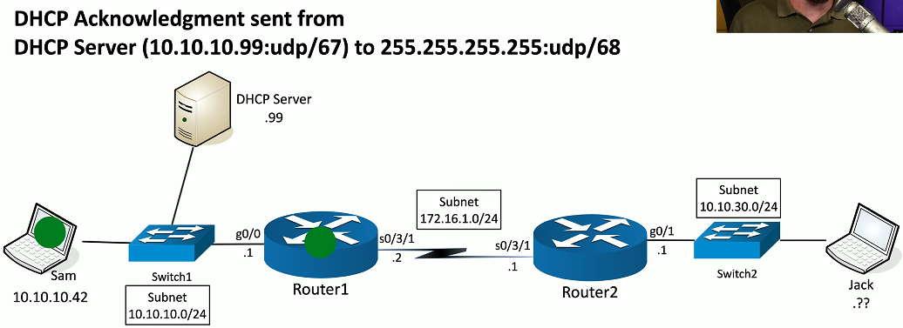

# DHCP 3.4a
- IPv4 address configuration used to be manual
  - IP address
  - Subnet mask
  - Gateway
  - DNS servers
  - NTP servers
  - ETC.
- October 1993 - The bootstrap protocol
  - BOOTP
- BOOTP didn't automatically define everything
  - Some manual configurations were still required
  - BOOTP also didn't know when an IP address might be available again
- Dynamic Host Configuration Protocol
  - Initially released in 1997, updated through the years
  - Provides automatic address/IP configuration for almost all devices
## DHCP Process
- DORA
  - A four-step process
- Discover
  - FInd a DHCP server
- Offer
  - Get an offer
- Request
  - Lock in the offer
- Acknowledge
  - DHCP server confirmation
### Step 1: Discover

### Step 2: Offer

### Step 3 : Request

### Step 4: Acknowledgement

## Managing DHCP is the enterprise
- Limited communication range
  - Uses the IPv4 broadcast domain
  - Stops at a router
- Multiple servers needed for redundancy
  - Across different locations
- Scalability is always an issue
  - May not want (or need) to manage DHCP servers at every remote location
- You're going to need a little help(er)
  - Send DHCP request across broadcast domains
### DHCP Relay

### Discover with DHCP Relay

### Offer with DHCP Relay

