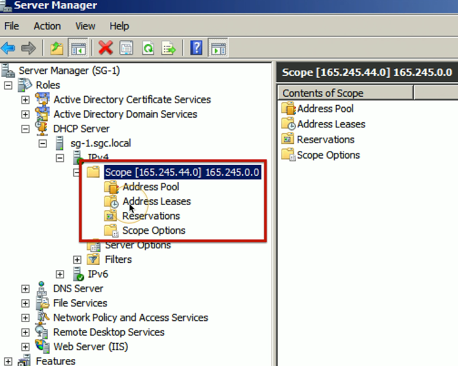

# Configuring DHCP 3.4b
## Scope Properties
- IP address range
  - And excluded addresses
- Subnet mask
- Lease durations
- Other scope options
  - DNS server
  - Default gateway
  - VOIP servers
## DHCP Pools
- Grouping of IP addresses
  - Each subnet has its own scope
    - 192.168.1.0/24
    - 192.168.2.0/24
    - 192.168.3.0/24
    - 192.168.4.0/24
    - And more...
- A scope is generally a single contiguous pool of IP address
  - DHCP exclusions can be made inside of the scope
  

## DHCP address assignment
- Dynamic assignment
  - DHCP server has a big pool of addresses to give out
  - Addresses are reclaimed after a lease period
- Automatic assignment
  - Similar to dynamic allocation
  - DHCP server keeps a list of past assignments
  - You'll always get the same IP address
## Address reservation
- Administratively configured
- Table of MAC addresses
  - Each MAC address has a matching IP address
- Other names
  - Static DHCP Assignment
  - Static DHCP
  - IP Reservation
### EX:

## DHCP leases
- Leasing your address
  - It's only temporary
  - But it can seem permanent
- Allocation
  - Assigned a lease time by the DHCP server
  - Adminstratively configured
- Reallocation
  - Reboot your computer
  - Confirms the lease
- Workstation can also manually release the IP address
  - Moving to another subnet
## DHCP renewal
- T1 Timer
  - Check in with the lending DHCP server to renew the IP address
  - 50% of the lease time (by default)
- T2 timer
  - If the original DHCP server is down, try rebinding with any DHCP server
  - 87.5% of the lease time (7/8ths)
### The DHCP lease process

## DHCP Options
- A special field in the DHCP message
  - Many, many options
- Options are part of the DHCP RFC
  - BOOTP called them "vendor extensions"
- 256(254 usuable) options
  - 0 through 255
  - 0 is pad, 255 is end
- Many common options
  - Subnet mask
  - Domain name server
  - Domain name
  - ETC.
- Options are configured on the DHCP server
  - Not all DHCP servers support option configuration
- Options have been added through the years
  - Option 129: Call Server IP address
  - Option 135: HTTP Proxy for phone-specific application
### DHCP option configurations
