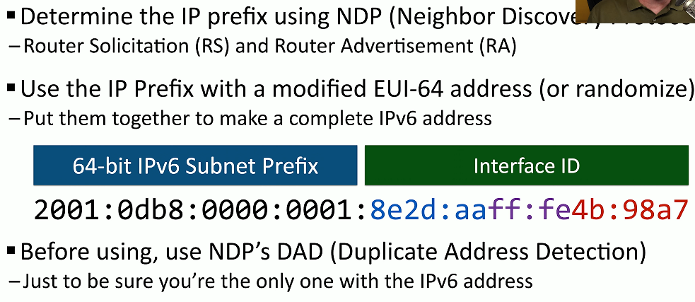

# IPv6 and SLAAC 3.4c
## Automatic IP addressing in IPv6
- DHCP servers
  - Similar process as IPv4
  - Requires redundant DHCP servers
  - Ongoing administration
- Stateless addressing
  - No separate server keeping the state
  - No tracking of IP or MAC addresses
  - Lease times don't exist
## NDP (Neighbor Discovery Protocol)
- No broadcasts!
  - Operates using multicast over ICMPv6
- Neighbor MAC Discovery
  - Replaced the IPv4 ARP
- SLAAC (Stateless Address Autoconfiguration)
  - Automatically configure an IP address without a DHCP server
- DAD (Duplicate Address Detection)
  - No duplicate IPs
- Discover routers
  - Router Solictation (RS)
  - Router Advertisement (RA)
### Finding Router

### SLAAC(Stateless Address Autoconfiguration)

