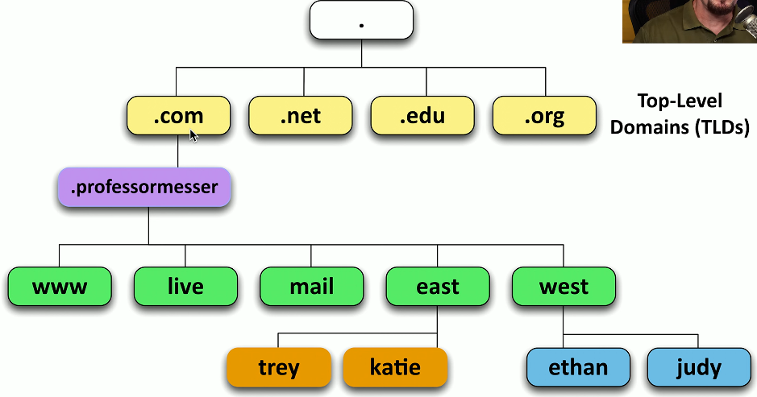
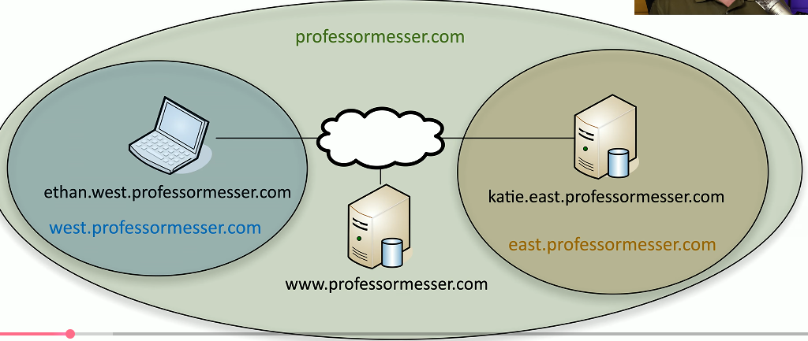
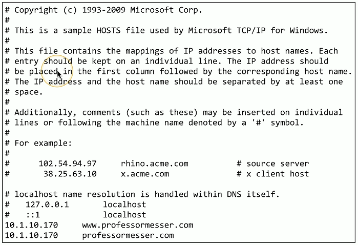
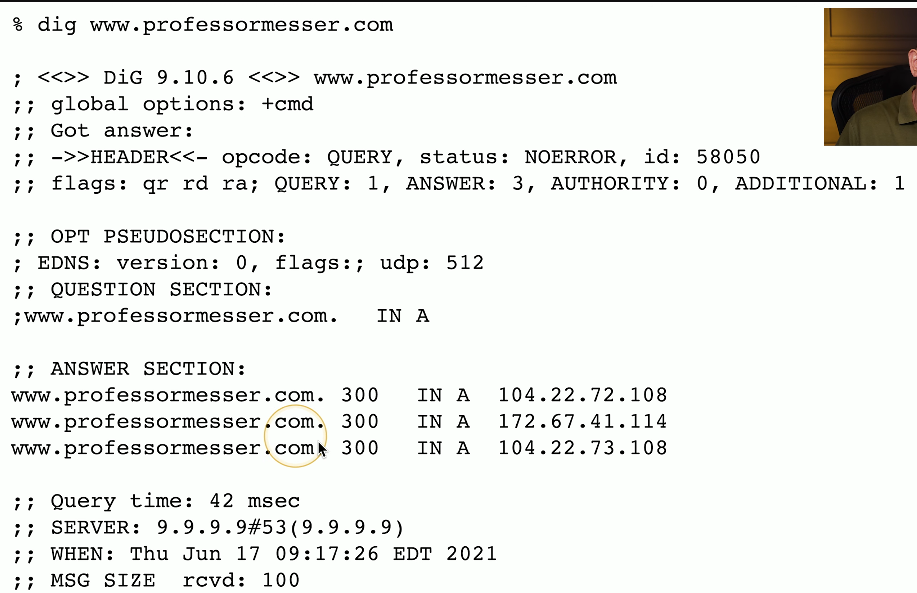

# Overview of DNS 3.4d
## Domain Name System
- Translate human-readable names into computer-readable IP addresses
- Hierarchical
  - Follow the path
- Distributed database
  - Many DNS servers
  - 13 root server clusters (Over 1,000 actualy servers)
  - Hundreds of generic top-level domains(gTLDs)
    - .com
    - .org
    - .net
  - Over 275 country code to-level domains (ccTLDs)
    - .us
    - .ca
    - .uk
### DNS Hierarchy Diagram:

### FQDN (Fully Qualified Domain Name)

## Primary and secondary DNS servers
- DNS is an important service
  - Internet
  - Active Directory
  - Application access
  - Redundant servers are commonly used
- Primary DNS server
  - Contains all of the zone information for a domain
  - Changes and updates are made to the primary server
- Secondary DNS server
  - Zone information is read-only
  - Zone transfers are pushed from the primary DNS server
- The primary/secondary updates are invisible to the end user
## Local name resolution
- You might need to override the DNS server
  - Access a test server
  - DNS server might be configured incorrectly
- Hosts file
  - Contains a list of IP addresses and host names
  - These are the preferred resolutions
- Some apps may not use the hosts file
  - Check the browser or app docs
  
### C:\Windows\System32\Drivers\etc\hosts:

## Lookups
- Forward lookup
  - Provides the DNS server with an FQDN
  - DNS server responds with an IP address
- Reverse DNS
  - Provides the DNS serer with an IP address
  - THe DNS server responds with an FQDN
### Forward Lookup

### Reverse Lookup

## The authority
- Authoritative
  - The DNS server is the authority for the zone
- Non-authoritative
  - Does not contain the zone source file
  - Probably cached information
- TTL (Time-to-live)
  - Configured on the authoritative server
  - Specifies how long a cache is valid
  - A very long TTL can cause problems if changes are made
  

  

## Recursive DNS queries
- Recursive query
  - Delegate the lookup toa DNS server
- The DNS server does not work and reports back
  - Large DNS cache provides a speed advantage
- Future queries use the local cache
  - Cache entries eventually timeout and are removed
  

## Securing DNS
- DNS is often transmitted in the clear
  - No built-in encryption
  - Relatively easy to spoof
  - Redirect email to a different mail server
- Domain Name Security Extensions (DNSSEC)
  - DNS responses from the server are digitally signed
  - A forgery would be easily identified
  - Requires additional configurations on the DNS serer
## Encrypting DNS
- DNS requests and responses are sent in the clear
  - Anyone can view the traffic
  - Security and privacy concerns
- DNS over TLS (DoT)
  - Send DNS traffic over tcp/853, but encrypt it with TLS/SSL
- DNS over HTTPS (DoH)
  - Send DNS traffic in an HTTPS packet
  - Looks like a web server communication over tcp/443
  - Some browsers use DoH by default