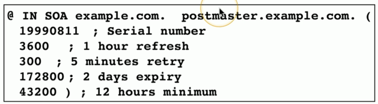
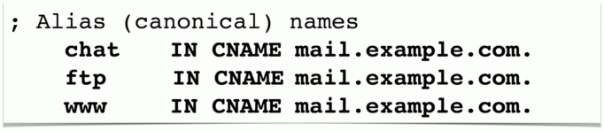
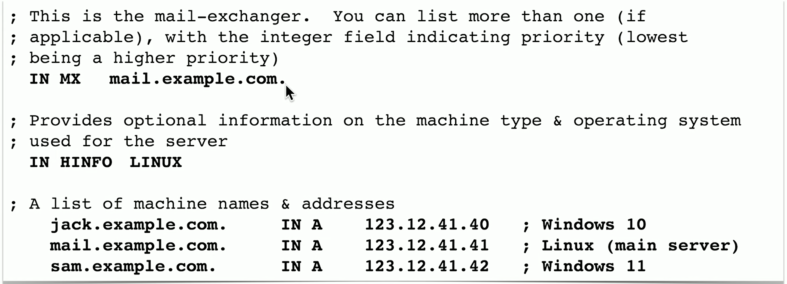
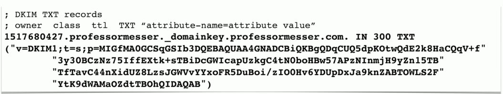
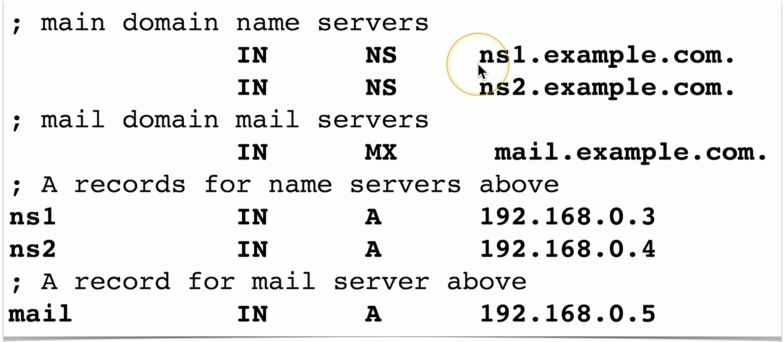
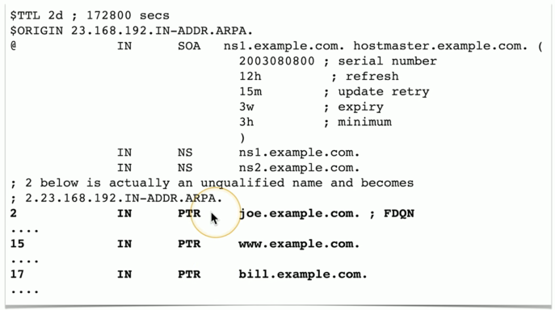

# DNS Records 3.4e
- Resources Records (RR)
  - The database records of domain names services
- Over 30 record types
  - IP addresses
  - Certificates
  - Host Alias names
### Sample forward lookup file

## Start of Authority (SOA)
- Describe the DNS zone details
- Structure
  - In SOA (Internet zone, State of Authority) with name of zone
  - Serial number
  - Refresh, retry, and expiry timeframes
  - Caching duration/TTL(Time-to-live)

## Address records (A)(AAAA)
- Defines the IP address of a host
  - This is the most popular query
- A records are for IPv4 addresses
  - Modify the A record to change th host name to IP address resolution
- AAAA records are for IPv6 addresses
  - The same DNS serer, different records
  

## Canoical name records (CNAME)
- A name is an alias of another, canonical name
  - One physical server, multiple services
  

## Mail exchanger record (MX)
- Determines the host name for the mail server
  - This isn't an IP address; it's a name

### MX record:

## Text records(TXT)
- Human-readable text information
  - Useful public information
- SPF protocol (Sender Policy Framework)
  - Prevent mail spoofing
  - Mail servers check that incoming mail really did come from an authorized host
  

- DKIM(Domain Keys Identified Mail)
  - Digitally sign your outgoing mail
  - Validated by the mail server, not usually seen by the end user
  - Put your public key in the DKIM TXT record
  

## Name server records(NS)
- List the name server for a domain
  - NS records point to the name of the server
  

## Pointer record(PTR)
- The reverse of an A or AAAA record
  - Added to a reverse map zone file
  