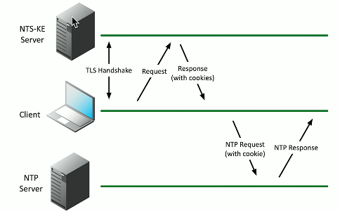

# Time Protocols 3.4f
## NTP (Network Time Protocol)
- Switches
- Routers
- Firewalls
- Servers
- Workstations
  - Every device has its own clock
- Sychronizing the clocks becomes critical
  - Log files
  - Authenticaion information
  - Outage details
- Flexible
  - You control how clocks are updated
- Very accurate
  - Accuracy commonly measured in the tens of milliseconds
## NTP clients and servers
- NTP server
  - Listens on udp/123, responds to time requests from NTP clients
  - Doesn not modify their own time
- NTP client
  - Requests time updates from NTP server
- NTP client/server
  - Requests time updates from an NTP server
  - Responds to time requests from other NTP clients
- Important to plan your NTP strategy
  - Which devices are clients, servers, and client/servers?
## Network Time Security (NTS)
- NTP sends traffic in the clear
  - The time of day isn't really a secrety
- The wrong time can be a significant problem
  - How do you know NTP server response can be trusted?
- NTP is updated to provide authentication
  - NTP information can be trusted
- TLS handshake is used for key exchange
  - Get authorization cookie from an NTS key exchange server
  

- Connect to an NTP server using this authentication
  - Both requests and responses are validated
## Precision Time Protocol(PTP)
- A more precise time protocol
  - A hardware-based time sychronization
- Nanosecond granularity
  - Important for:
    - Industrial applications
    - Finanical trading
- Often implemented as specialized hardware
  - Avoids delays from the operating system and applications