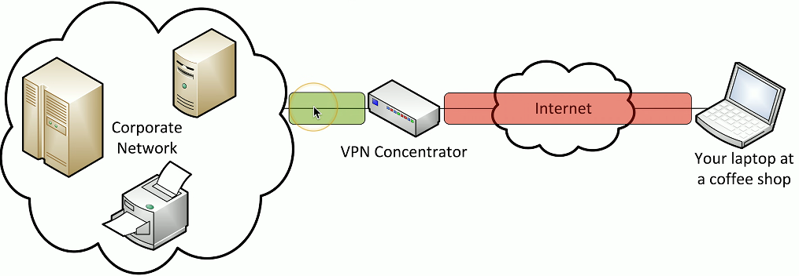
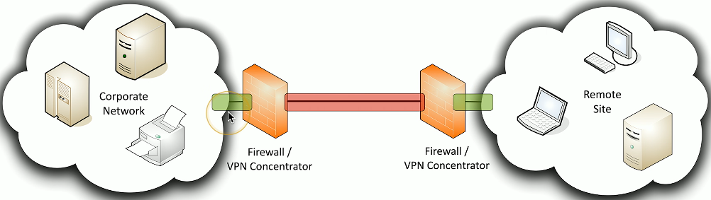

# VPN
- Virtual Private Networks
  - Encrypted (private) data traversing a public network
- Concentrator
  - Encryption/decryption access device
  - Often integrated into a firewall
- Many deployment options
  - Specialized cryptographic hardware
  - Software-based options available
- Used with client software
  - Sometimes built into the OS
## Client-to-site VPN
- On-demand access from a remote device
  - Software connects to a VPN connector
- Some software can be configured as always-on

## Site-to-Site VPN
- Always-on
  - Or almost ways
- Firewalls often act as VPN concentrators
  - Probably already have firewalls in place
  

## Clientless VPNs
- Hypertext Markup Language version 5
  - The language commonly used in web browsers
- Includes comprehensive API support
  - Application Programming Interface
  - Web cryptography API
- Create a VPN tunnel without a separate VPN application
  - Nothing to install
- Use an HTML5 compliant browser
  - Communicate directly to the VPN concentrator
## Split tunnel vs. full tunnel
- Full tunnel
  - All traffic is sent through the VPN tunnel
  - The client makes no additional forwarding decisions
  - May require additional routing at the concentrator
- Split tunnel
  - VPN traffic is sent through the tunnel
  - Non-VPN traffic is sent normally
  - Configured in the VPN software

### Full Tunnel Diagram:

### Split Tunnel Diagram:
