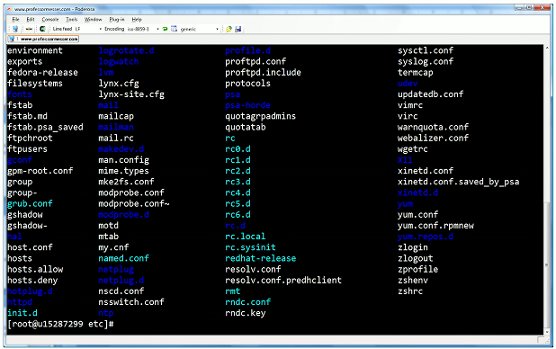

# Remote Access 3.5b
## SSH (Secure Shell)
- Encrypted console communication - tcp/22
- Looks and acts the same as Telnet - tcp/23

## Graphical user interface (GUI)
- Share a desktop from a remote location
  - It's like you're there
- RDP (Microsoft Remote Desktop Protocol)
  - Clients for MAC OS
  - Linux
  - Others as well
- VNC (Virtual Networking Computing)
  - Remote Frame Buffer (RFB) protocol
  - Clients for many operating systems
  - Many are open source
- Commonly used for technical support
  - And for scammers
## API Integration
- Control and manage devices
  - Hundreds of firewalls, routers, switches, and servers
  - Login to each device and make changes manually
- Automate the command line
  - Batch processes
  - Very little control or error handling
- Application programming interfaces (APIs)
  - Interact with third-party devices and services
  - Cloud services, firewalls, operating systems
  - Talk their language
## Console
- Directly connect to the device
  - Traditionally a serial connection
    - DB9 connector
    - RJ45 serial
    - USB connection
- When all else fails
  - The console will be available
- A text-based serial interface
  - The console
- Requires a serial or USB connection
  - May need a USB to DB9 serial adapter
## Jumpbox
- Access secure network zones
  - Provides an access mechanism to a protected network
- Highly-secured device
  - Hardened and monitored
- SSH/Tunnel/VPN to jump server
  - RDP, SSH, or jump from there
- A significant security concern
  - Compromise of a jump server is a significant breach
  
## In-band management
- Assign as IP address to a device
  - Switch
  - Router
  - Firewall
  - ETC.
- May be a separate Ethernet interface
  - Often marked on the device
- May be accessible from any connected device
  - The IP address is inside the device
- Access the device
  - SSH
  - Browser-based console

  

## Out-of-band Management
- The network isn't available
  - Or the device isn't accessible from the network
- Most devices have a separate management interface
  - Usually a serial connection/USB
- Connect a modem to change
  - Cable, DSL, satellite, etc.
- Console router/comm server
  - Out-of-band access for multiple devices
  - Connect to the console router, then choose where you want to go