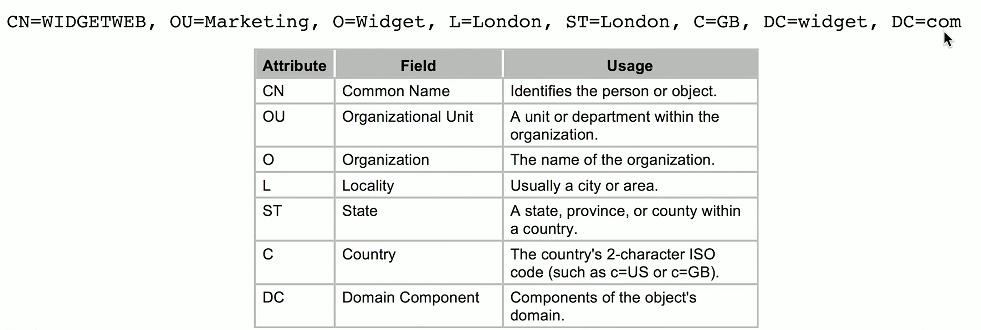
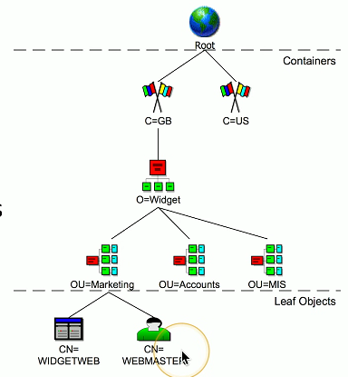

# Authentication 4.1b
## AAA Framework
- This is who you claim to be
- Usually your username
- Authentication
  - Prove you are who you say you are
  - Password and other authorization factors
- Authorization
  - Based on your identification and authentication, what access do you have?
- Accounting
  - Resources used:
    - Login time
    - Data sent and received
    - Logout time
### Gaining access

## Single sign-on (SSO)
- Provide credentials one time
  - Get access to all available or assigned resources
  - No additional authentication required
- Usually limited by time
  - Single authentication can work for 24 hours
  - Authenticate again after the timer expires
- The underlying authentication infrastructure must support SSO
  - Not always an option
## RADIUS (Remote Authentication Dial-in User Service)
- One of the more common AAA protocols
  - Supported on a wide variety of platforms and devices
  - Not just for dial-in
- Centralized authenitication for users
  - Routers, switches, firewalls
  - Server authentication
  - Remote VPN access
  - 802.1X network access
- RADIUS services available on almost any server operating system
## LDAP (Lightweight Directory Access Protocol)
- Protocol for reading and writing directories over an IP network
  - An organized set of records, like a phone directory
- X.500 specification was written by the International Telecomunnications Union (ITU)
  - They know directories!
- DAP ran on the OSI protocol stack
  - LDAP is lightweight
- LDAP is the protocol used to query and update an X.500 directory
  - Used in Windows Active Directory
  - Apple OpenDirectory
  - Novell eDirectory
  - ETC.
## X.500 Distinguished Names
- attribute = value pairs
- Most specific attribute is listed first
  - This may be similar to the way you already think
  

## X.500 Directory Information Tree

- Hierarchial structure
  - Builds a tree
- Container objects
  - Country
  - Organization
  - Organizational units
- Leaf objects
  - User
  - Computers
  - Printers
  - Files

## Security Assertion Markup Language (SAML)
- Open standard for authentication and authorization
  - You can authenticate through a third-party to gain access
  - One standard does it all, soft of
- Not originally designed for mobile apps
### The SAML auethentication flow

## TACACS
- Terminal Access Controller Access-Control System
  - Remote authentication protocol
  - Created to control access to dial-up line sto ARPANET
- TACACS+
  - The latest version of TACACS, not backwards compatible
  - More authentication requests and response codes
  - Released as an open standard in 1993
## Multifactor Authentication
- Prove who you are
  - Use different methods
  - A memorized password
  - A mobile app
  - Your GPS location
- Factors
  - Something you are
  - Something you know
  - Somewhere you are
  - Something you have
## TOTP
- Time-based One-Time Password Algorithm
  - Use a secret key and the time of day
  - No incremental counter
- Secret key is configured ahead of time
  - Timestamps are sychronized via NTP
- Timestamp usually increments every 30 seconds
  - Put in your username, password, and TOTP code
- One of the more common OTP methods
  - Used by:
    - Google
    - Facebook
    - Microsoft
    - ETC.