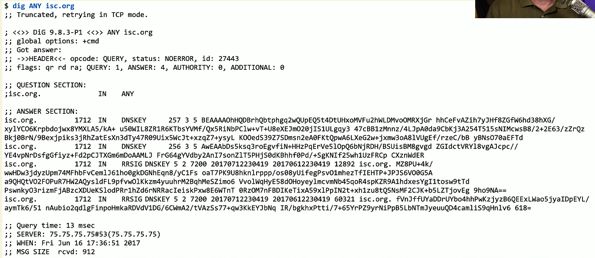

# Denial of Service 4.2a
- Force a service to fail
  - Overload the service
- Take advantage of a design failure or vulnerability
  - Keep your systems patche!
- Cause a system to be unavailable
  - Competitive advantage
- Create a smokescreen for some other exploits
  - Precursor to a DNS spoofing attack
- Doesn't have to be complicated
  - Turn off the power
## A "friendly" DoS
- Unintentionally DoSing
  - It's not always a ne'er-do-well
- Network DoS
  - Layer 2 loop without STP
- Bandwidth DoS
  - Downloading multi-gigabyte Linux distribution over a DSL line
- The water line breaks
  - Get a good shop vacuum
## Distributed Denial of Service (DDoS)
- Launch an army of computers to bring down a service
  - Use all the bandwidth or resources - traffic spike
- This is why the attackers have botnets
  - Thousands or millions of computers at your command
  - At its peak, Zeus botnet infected over 3.6 million PCs
  - Coordinated attack
- Asymmetric threat
  - The attacker may have fewer resources than the victim
## DDoS reflection and amplification
- Turn your small attack into a big attack
  - Often reflected off another device or service
- An increasingly common network DDoS technique
  - Turn Internet services against the victim
- Uses protocols with little (if any) authentication or checks
  - NTP, DNS, ICMP
  - A common example of protocol abuse
### Turning up the volume

### DNS amplification DDoS
