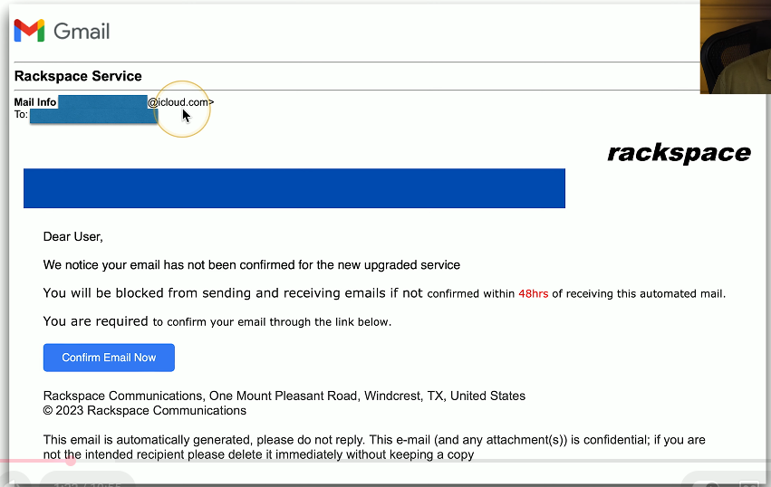
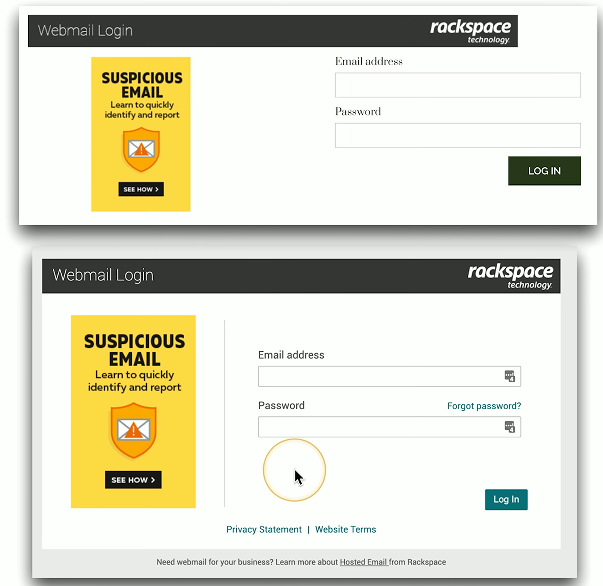

# Social Engineering 4.2f
## Phishing
- Social Engineering with a touch of spoofing
  - Often delivered by email, text, etc.
  - Very remarkable when well done
- Don't be fooled
  - Check your URL
- Usually there's something not quite right
  - Spelling, fonts, graphics

  

  

## Shoulder surfing
- You have access to important information
  - Many people want to see
  - Curiosity, industrial espionage, competitive advantage
- This is surprisingly easy
  - Airport/Flights
  - Hallway-facing monitors
  - Coffee shops
- Surf from afar
  - Binoculars/Telescopes
    - Easy in the big city
  - Webcam monitoring
### Prevent shoulder surfing
- Control your input
  - Be aware of your surroundings
- Use privacy filters
  - It's amazing how well they work
- Keep your monitor out of sight
  - Away from windows and hallways
- Don't sit in front of me on your flight
  - I can't help myself
## Tailgating and piggybacking
- Tailgating uses an authorized person to gain unauthorized access to the building
  - The attacker does not have consent
  - Sneaks through when nobody is looking
- Piggybacking follows the same process, but the authorized person is giving consent
  - Hold the door, my hands are full of donut boxes
  - Sometimes you shouldn't be polite
- Once inside, there's little to stop you 
  - Most security stops at the border
## Watching for tailgating
- Policy for visitors
  - You should be able to identify anyone
- One scan, one person
  - A matter of policy or mechanically required
- Access Control Vestibule/Airlock
  - You don't have a choice
- Don't be afraid to ask
  - Who are you and why are you here?
## Dumpster diving
- Mobile garbage bin
  - United States brand name "Dumpster"
  - Similar to a rubbish skip
- Important information thrown out with the trash
  - Thanks for bagging your garbage for me!
- Gather details that can be used for a different attack
  - Impersonate names, use phone numbers
- Timing is important
  - Just after end of month, end of quarter
## Is it legal to dive in a dumpster?
- I am not a lawyer.
- In the United States, it's legal
  - Unless there's a local restriction
- If it's in the trash, it's open season
  - Nobody owns it
- Dumpsters on private property or "No Trespassing" signs may be restricted
  - You can't break the laww to get to the rubbish
- Question? Talk to a legal professional
## Protect your rubbish
- Secure your garbage
  - Fence or a lock
- Shred your documents
  - This will only go so far
  - Governments burn the good stuff
- Go look at your trash
  - What's in there?