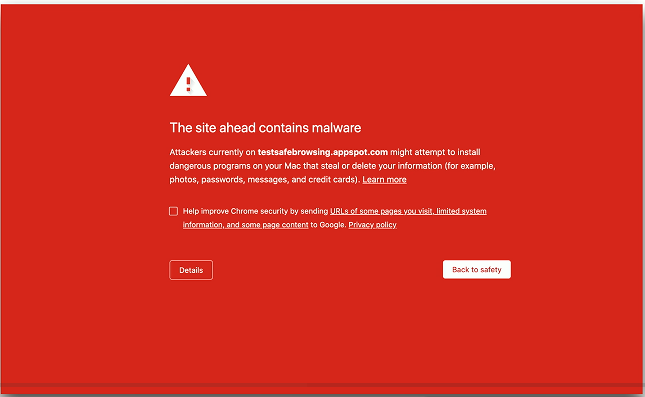

# Malware 4.2g
- Malicious software
  - These can be very bad
- Gather information
  - Keystrokes
- Participate in a group
  - Controlled over the 'net
- Show you advertising
  - Big money
- Viruses and worms
  - Encrypt your data
  - Ruin your day

## Malware Types and Methods
- Viruses
- Worms
- Ransomware
- Trojan Horse
- Rootkit
- Keylogger
- Adware/Spyware
- Bloadware
- Logic bomb
## How you get malware
- These all work together
  - A worm takes advantage of a vulnerability
  - Installs malware that includes a remote access backdoor
  - Boy may be installed later
- Your computer must run a program
  - Email link - Don't click links
  - Web page pop-up
  - Drive-by download
  - Worm
- Your computer is vulnerable
  - Operating system - Keep your OS updated!
  - Applications - Check with your publisher
## Your data is valuable
- Personal data
  - Family pictures and videos
  - Important documents
- Organization data
  - Planning documents
  - Employee personally identifiable information (PII)
  - Financial information
  - Company private data
- How much is it worth?
  - There's a number