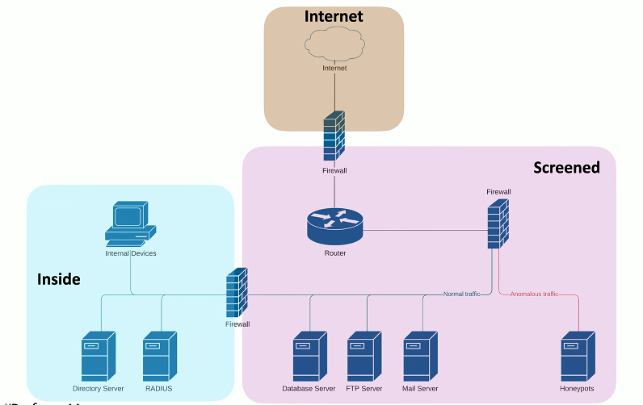

# Security Rules 4.3b
## Access Control Lists (ACLs)
- Allow or disallow traffic
  - Groupings of categories
  - Source IP, Destination IP, port numbers, time of day, application, etc.
- Restrict access to network devices
  - Limit by IP address or other identifier
  - Prevent regular user/non-admin access
- Can be implemented in many ways
  - Router, firewall, operating system policies, etc.
### Firewall security policies

## Firewall Rules
- A logical path
  - Usually top-to-bottom
- Can be very general or very specific
  - Specific rules are usually at the top
- Implicit deny
  - Most firewalls include a deny at the bottom
    - Even if you didn't put one

### Web server firewall ruleset

## URL filtering
- Allow or restrict based on Uniform Resource Locator
  - Also called a Uniform Resource Identifier (URI)
  - Allow list/Block list
- Managed by category
  - Auction, Hacking, Malware, Travel, Recreation, etc.
- Can have limited control
  - URLs aren't the only way to surf
- Often integrated into a NGFW
  - Filters traffic based on category or specific URL
## Content filtering
- Control traffic based on data within the content
  - URL filtering, website category filtering
- Corportae control of outbound and inbound data
  - Sensitive materials
- Control of inappropirate content
  - Not safe for work
  - Parental controls
- Protection against evil
  - Anti-virus, anti-malware
## Screened subnet
- An additional layer of security between you and the internet
  - Public access to public resources
  - Private data remains inaccessible
  

## Security zones
- Zone-based security technology
  - More flexible (and secure) than IP address ranges
- Each area of the network is associated with a zone
  - Trusted, untrusted
  - Internal, external
  - Inside, Internet, Servers, Databases, Screened
- This simplifies security policies
  - Trusted to Untrusted
  - Untrusted to Screened
  - Untrusted to Trusted

