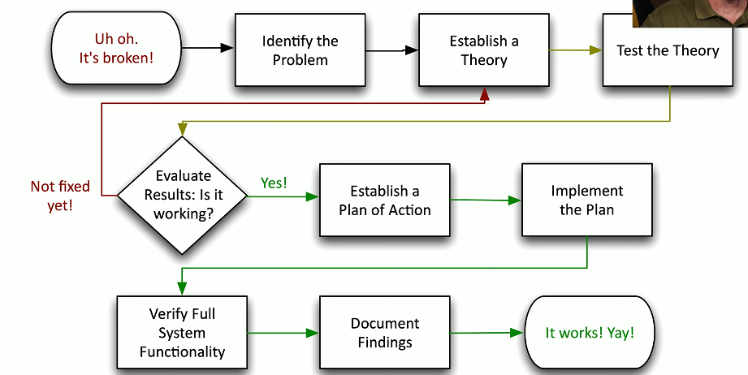

# Network Troubleshooting Methodology 5.1a
## Troubleshooting a network

### 1. Identify the problem
- Gather information
  - Get as many details as possible
  - Duplicate the issue, if possible
- Question users
  - Your best sources of details
- Identify symptoms
  - May be more than a single symptom
- Determine if anything has changed
  - Who's in the wiring closet
- Duplicate the problem, if possible
  - The issue is much easier to troubleshoot if you can see it happening
- Approach multiple problems individually
  - Break problems into smaller pieces
### 2. Establish a theory of probable cause
- Start with the obvious
  - Occam's razor supplies
- Consider everything
  - Even the not-so-obvious
  - Examine the problem from the top of the OSI model to the bottom
  - And then from the bottom to the top
- Divide and conquer
  - Break the problems into smaller pieces
  - Remove the pieces that don't apply
### 3. Test the theory
- Confirm the theory
  - Determine next steps to resolve problem
- Theory didn't work?
  - Re-establish new theory or escalate
  - Call an expert
### 4. Create a plan of action
- Build the plan
  - Correct the issue with a minimum of impact
  - Some issues can't be resolved during production hours
- Identify potential effects
  - Every plan can go bad
  - Have a plan B
  - Have a plan C
### 5. Implement the solution
- Try the fix
  - Implement during the change control window
- Escalate as necessary
  - You may need help from a 3rd party
### 6. Verify full system functionality
- It's not fixed until it's really fixed
  - The test should be part of your plan
  - Have your customer confirm the fix
- Implement preventive measures
  - Let's avoid this issue in the future
### 7. Document findings
- It's not over until you update the knowledge base
  - Important lessions were learned
  - Don't lose valuable knowledge!
- Consider a formal database
  - Help desk case notes
  - Seachable database

## Troubleshooting a network
1. Identify the problem:
   - Information gathering, identify symptoms, question users, determine if has changed
2. Establish a theory of probable cause:
   - Question the obvious
3. Test the theory to determine cause:
   - Once theory is confirmed determine next steps to resolve the problem and identify potential effects
4. Implement the solution or escalte as necessary
5. Verify full system functionality and, if applicable, implement preventative measures
6. Document findings, actions and outcomes