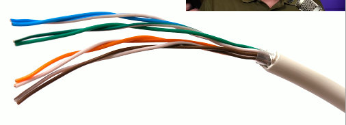
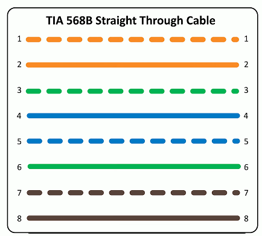
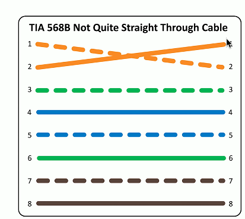

# Cable Issues 5.2a
## Using the correct fiber optics

## Fiber mismatching
- Core and cladding sizes are relatively standard
  - Fiber and frequencies must match equipment
  - Signal errors will be seen on the interface

  

## Cable categories
- Cable construction is standardized
  - Telecommunications Industry Association (TIA)
- TIA sets the minimum physical cable paramenters
  - Cables metting the standard are assigned a category (cat)
  - Insertion loss, near end crosstalk, far end crosstalk, etc.
- IEEE networking standards refers to the TIA cable categories
  - 1000BASE-T minimum cable is category 5
  - 10GBASE-T minimum cable is category 6 and 6A
  

## Using the right cable
- Speed/bandwidth
  - Theoretical maximum data rate
  - Usually measured in bits per second
  - The size of the pipe
- Throughput
  - Amount of data transferred in a given timeframe
  - Usually measured in bits per second
  - How much water if flowing through the pipe
- Distance
  - Know the maximum distance
  - Varies based on copper, fiber, repeaters, etc.
## The right cable category
- Validate the cable
  - Use the best practices during installation
  - Tester matches the closest cable category
- Cable should meet the minimum requirements
  - Physical errors will increase error counts
  - Signal attenuation, loss of signal, CRC errors
## Unshielded and shielded cable
- UTP (Unshielded Twisted Pair)
  - No additional metal shielding
  - The most common twisted pair cabling
  

- STP (Shielded Twisted Pair)
  - Additional shielding protects against interference
  - Requires the cable to be grounded
  

## Crosstalk (XT)
- Signal on one circuit affects another circuit
  - In a bad way
- Leaking signal
  - You can sometimes hear the leak
- Measure XT with cable testers
  - Some training may be required
## Crosstalk metrics
- Near end Crosstalk (NEXT)
  - Interference measured at the transmitting end
  - The near end
- Far End Crosstalk (FEXT)
  - Interference measured at away from the transmitter
- Alien Crosstalk (AXT)
  - Interference from other cables
- Attenuation to Crosstalk Ratio (ACR)
  - Difference between insertion loss and NEXT
  - Signal-to-Noise Ration (SNR)
## Troubleshooting crosstalk
- Almost always a wiring issue
  - Check your crimp
- Maintain your twists
  - The twist helps avoid crosstalk
- Category 6A increases cable diameter
  - Increased distance between pairs
- Test your installation
  - Solve problems before they are problems
## Avoid EMI and interference
- Electromagnetic Interference
- Cable handling
  - No twisting - don't pull or stretch
  - Watch your bend radius
  - Don't use staples, watch your cable ties
- EMI and interference with copper cables
  - Avoid power cords, flourescent lights, electrical systems, and fire prevention components
- Test after installation
  - You can find most of your problems before use
## Attenuation
- Usually gradual
  - Signal strength diminishes over distance
  - Loss of signal intensity as signal moves through a medium
- Happens across all mediums
  - Electrical signals through copper
  - Light through fiber
  - Radio waves through the air
## Troubleshooting termination
- Cables can foul up a perfectly good plan
  - Test your calbes prior to implementation
- Many connectors look alike
  - Do you have a good cable mapping device?
- Get a good cable person
  - It's an art
## Improper termination
- Near and far pins in cables aren't where they are supposed to be
  - Pin 1 goes to pin 1, pin 2 to pin 2, etc.
- Performances or connnectivity issues
  - May drop grom 1 Gbit,sec to 100 Mbit/sec
  - May not connect at all

## Reversing transmit and receive
- Wiring mistake
  - Cable ends
  - Punchdowns
- Easy to find with a a wiremap
  - 1-3, 2-6, 3-1, 6-2
  - Simplify to identify
- Some network interfaces will automatically correct (Auto-MDIX)
  - Don't rely on this functionality