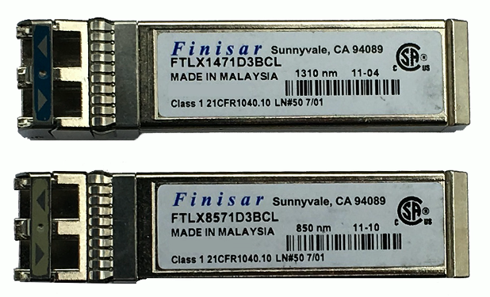

# Hardware Issue 5.2d
## Power over Ethernet (PoE)
- Power provided on an Ethernet cable
  - One wire for both network and electricity
  - Phones, cameras, wireless access points
  - Useful in difficult-to-power areas
- Power provided at the switch
  - Built-in power - Endspans
  - In-line power injector - Midspans
### PoE, PoE+, PoE++
- PoE
  - The original PoE specification
  - 15.4 watts DC power, 350 mA max current
- PoE+
  - 25.5 watts DC power, 600 mA max current
- PoE++
  - 51 W (Type 3), 600 mA max current
  - 71.3 W (Type 4), 960 mA max current
  - PoE with 10GBASE-T
- Compare the divce with the switch support
  - PoE+ won't power a PoE++ device
## PoE Switch
- Power over Ethernet interfaces
  - Commonly marked on the switch or interfaces
- Check switch for total PoE power supported
  - "Up to 600W"
  - Calculate the device requirements for the power budget

## Single mode vs. multimode
- Transceivers have to match the fiber
  - Single mode transceiver connects to single mode fiber
- Transceiver needs to match the wavelength
  - 850nm, 1310nm, etc.
- Use the correct transceievers and optical fiber
  - check the entire link
- Signal loss
  - Dropped frame, missing frames
### Transceiever mismatch

## Transceiver signal strength
- Devices must receive enough signal
  - Can't work if the signal isn't strong enough
- Each device has a sensitivity level
  - Some devices can "hear" better than others
- Calculate the power budget
  - Determine transmitter power (often measured in dBM)
  - Calculate signal loss based onm distance, connectors, splices, etc.
  - Subtract signal loss from the transmitter power
  - Compare to minimum receiver power
### Transceiver signal strength
