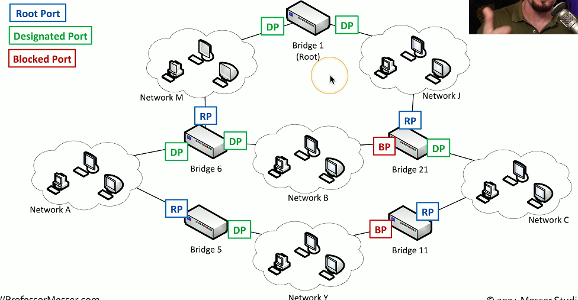

# Switching Issues 5.3a
## Switching loops
- A fear of everything network administrator
  - Spanning Tree Protocol is often configured
- Switches communicate by MAC address
  - Every device hs its own address
  - Every packet is directed
- Broadcasts and multicasts are sent to all
  - Broadcast repeated to all switch ports
- Nothing at the MAC address level to identify loops
  - IP has TTL (Time-to-Live)
### No loop

### The loop

## Spanning Tree Protocol (STP)
- Bridges are always talking to each other
  - Uses MAC-layer multicasts (01:80:C2:00:00:00)
  - Bridge Protocol Data Unit (BPDU)
  - Sends configuration and any topology changes
- Default "hello" interval is 2 seconds
  - Miss three of those, and the link is considered down
  

## Root bridge selection
- When starting, the bridges elect a root bridge
  - All other bridges choose the best connection to the root
- All bridges/switches are assigned a bridge ID between 0 and 61440
  - Lowest ID is the root
  - If there's a tie, the lowest MAC address number wins
- Each bridge assigns a port role to each interface
  - Root, designate, or blocked
## STP port states
- Blocking/Discarding
  - Not forwarding to prevent a loop
- Listening
  - Not forwarding and cleaning the MAC table
- Learning
  - Not forwarding and adding to the MAC table
- Forwarding
  - Data passes through and is fully operational
- Disabled
  - Administrator has turned off the port
## VLAN assignment
- Network link is active and IP address is assigned
  - No access to resources or limited functionality
- Every switch interface is configured as an access port or a trunk port
  - Each access port is assigned to a VLAN
- Confirm the specfic switch interface
  - Check the VLAN assignment
- This is also a common issue
  - A quick fix

  

## ACLs break perfectly good networks
- Clients are working
  - DHCP is assigning correct IP addresses
  - Routing tables look correct
- Packets are still dropping
- Everything could be configured perfectly
  - ACLs would still break the traffic flow
- Always include an ACL check when troubleshooting
  - Save lots of time
## ACL best practice
- More granular rules should be first
  - Very similar to a firewall
  - The ACL stops evaluation after a match
  - Broader rules at the top would provent more specific rules from firing
- Best practice: Before editing an ACL, disable on an interface
  - Adding an access list without any rules will filter all traffic
  - ACLs deny all by default
  