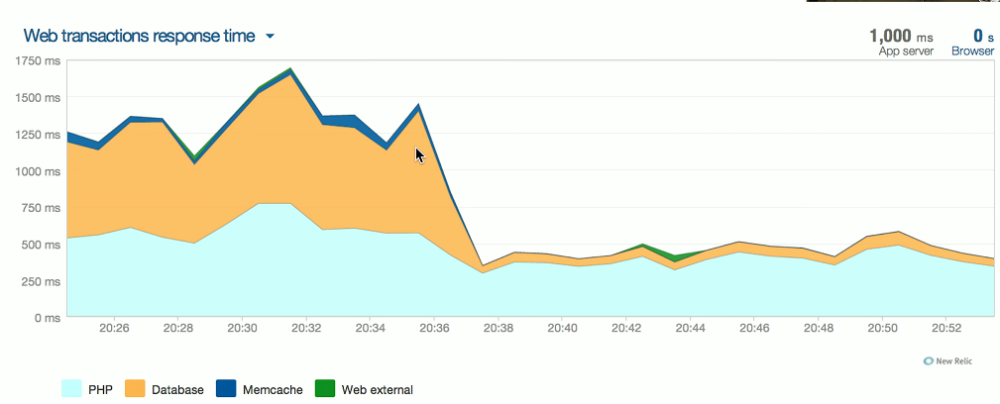
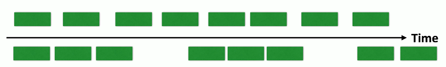

# Performance Issues 5.4a
## Congestion
- The network is a finite resource
  - 1000BASE-T is one gigabit per second
  - It can't go any faster
- A busy network may attempt to send 2 gigabit per second
  - Contention brings packet queueing, buffering, etc.
- There are only so many resources
  - Buffer will fill
  - Some data may be dropped
- Increase the size of the road
  - Or decrease the number of cars
## Bottlenecks
- There's never just one performance metric
  - A series of technologies working together
- I/O bus, CPU speed, storage access speed, WAN bandwidth, local network speeds, etc.
  - One of these can slow all of the others down
- You must monitor all of them to find the slowest one
  - This may be more difficult than you might expect
### Resolving the network bottleneck

## Bandwidth usage
- The fundamental network statistic
  - Amount of network use over time
- Throughput
  - The amount of data successfully transferred through the network
- Many different ways to monitor
  - SNMP, NetFlow, sFlow, IPFIX, protocol agent, software agent
- Throughput capacity
  - Total throughput has a maximum value
  - Based on the slowest link

## Latency
- A delay between the request and the response
  - Waiting time
- Some latency is expected and normal
  - Laws of physics always apply
- Examine the response times at every step along the way
  - This may require multiple measurements tools
- Packet captures can provide detailed analysis
  - Microsecond granularity
  - Get captures from both sides
## Packet loss
- Discards, packet drops
  - No errors in the packet, but system could not transmit or receive the data
- Packets are lost
  - Corrupted during transmission
  - Dropped after validation
- Data must be retransmitted
  - Overall communication is delayed
  - Uses additional resources
## Jitter
- Most real-time media is sensitive to delay
  - Data should arrive at regular intervals
  - Voice communication, live video
- If you miss a packet, there's no retransmission
  - there's no time to "rewind" your phone call
- Jitter is the time between frames
  - Excessive jitter can cause you to miss information, "choppy" voice calls
  
