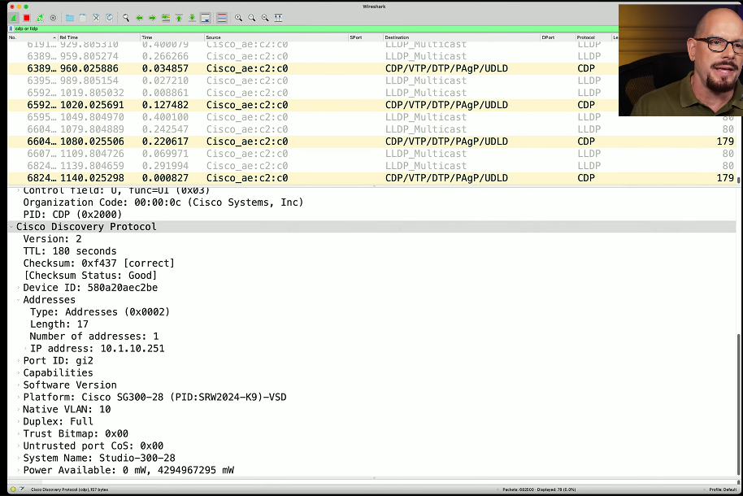

# Software tools 5.5a
## Protocol analyzers
- Solve complex application issues
  - Get into the details
- Gather frames on the network
  - Or in the air
  - Sometimes built into the device
- View traffic patterns
  - Identify unknown traffic
  - Verify packet filtering and security controls
- Large scale storage
  - Big data analytics
## Nmap
- Network mapper
  - Find and learn more about network devices
- Port scan
  - Find devices and identify open ports
- Operationg system scnam
  - Discover the OS without logging into a device
- Service scan
  - What service is available on a device?
    - Name
    - Version
    - Details
- Additional scripts
  - Nmap Scripting Engine (NSE) 
    - Extend capabilities
    - Vulnerability scans
- Active
  - Scan for IP addresses and open ports
    - Operating systems
    - Services
    - ETC.
- Pick a range of IP addresses
  - See who responds to the scan
- Visually map the network
  - Gather information on each device
  - IP, operating system, services, etc.
- Rogue system detection
  - It's difficult to hide from a layer 2 ARP
## Discovering network devices
- Switched networks can be a challenge
  - Many different interfaces
  - Each interface can have a very different configuration
  - Identify the port number, MAC address, VLAN ID, etc.
- CDP - Cisco Discovery Protocol
  - Proprietary Cisco protocol
  - Still very common
- LLDP - Link Layer Discovery Protocol
  - Vendor neutral
  - A more common discovery method

## Speed test sites
- Bandwidth testing
  - Transfer a file, measure the throughput
- Provide useful pre- and post- change analysis
  - Test, install firewall/packet shaper, test again
- Measure at different times of the day
  - Can be automated or manual
- Not all sites are the same
  - Number of servers (point of presence - POP)
  - Bandwidth at the POP
  - Testing methodology
### Speed test sites
- ISP
  - Speedtest.xfinity.net
  - www.att.com/speedtest
- fast.com
- speedOf.me
- speedtest.net
- testmy.net