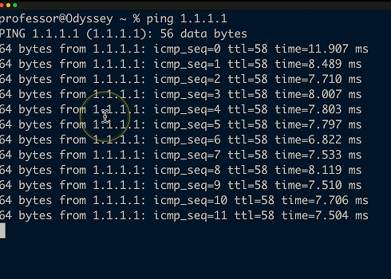
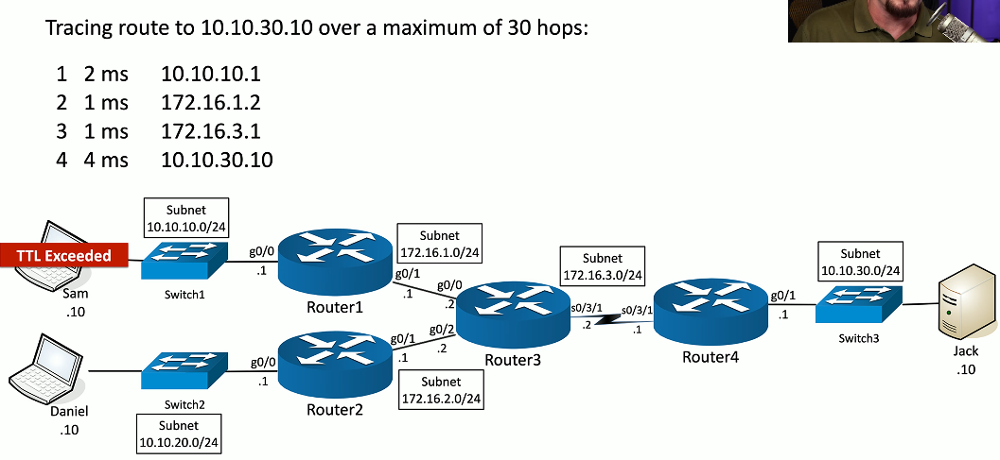
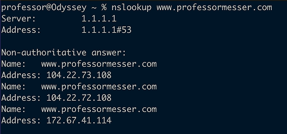
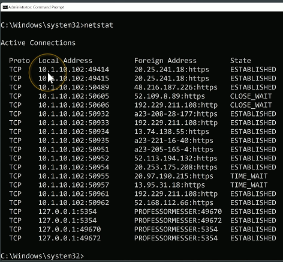
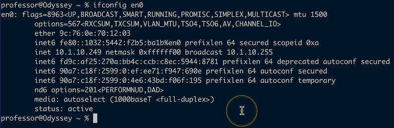

# Command Line Tools
## Ping
- Test reachability
  - Determine round-trip time
  - Uses Internet Control Message Protocol (ICMP)
- One of your primary troubleshooting tools
  - Can you ping the host?

## Traceroute
- Determine the route a packet takes to a destination
  - Map the entire path
  - tracert (Windows) or traceroute (Unix/Linux/macOS)
- Takes advantage of ICMP Time-to-live exceeded error message
  - The time in TTL refers to hops, not seconds or minutes
  - TTL=1 is the first router, TTL=2 is the second router, etc.
- Not all devices will reply with ICMP Time exceeded messages
  - Some firewalls filter ICMP
  - ICMP is low-priority for many devices
###  Flavors of traceroute
- Not all traceroute are the same
  - Minor differences in the transmitted payload
- Windows commonly sends ICMP echo requests
  - Receives ICMP time exceeded messages
  - And an ICMP echo reply from the final/destination device
  - Unfortunately, outgoing ICMP is commonly filtered
- Some operating systems allow you to specify the protocol used
  - Linux, Unix, Mac OS, etc.
### The mechanics of traceroute

## nslookup and dig
- Lookup information from DNS servers
  - Canonical names, IP addresses, cache timers, etc.
- nslookup
  - Both Windows and POSIX-based
  - Lookup names and IP addresses
  - Deprecated (use dig instead)
  

- dig (Domain Information Groper)
  - More advanced domain information
  - Probably your firce choice
  - Windows: http://www.isc.org/downloads/bind/
  

## tcpdump
- Capture packets from the command line
  - Very convenient
- Available in most Unix/Linux operating systems
  - Included with Mac OS X, available for Windows (WinDump)
- Apply filters, view in real-time
  - Quickly identify traffic patterns
- Save the data, use in another application
  - Written in standard pcap format
- Can be an overwhelming amount of data
  - Takes a bit of practice to parse and filter
## netstat
- Network statistics
  - Many different operating systems
- netstat -a
  - Show all active connections
- netstat -b
  - Show binaries (Windows)
- netstat -n
  - Do not resolve names

## ipconfig / ifconfig / ip
- Most of your troubleshooting starts with your IP address
  - Ping your local router/gateway
- Determine TCP/IP and network adapter information
  - And some additional IP details
- ipconfig - Windows TCP/IP configuration

- ifconfig - Linux interface configuration

- ip address - The latest Linux utility

## Address Resolution Protocol
- Determine a MAC address based on an IP address
  - You need the hardware address to communicate
- arp -a
  - View local ARP table
  
