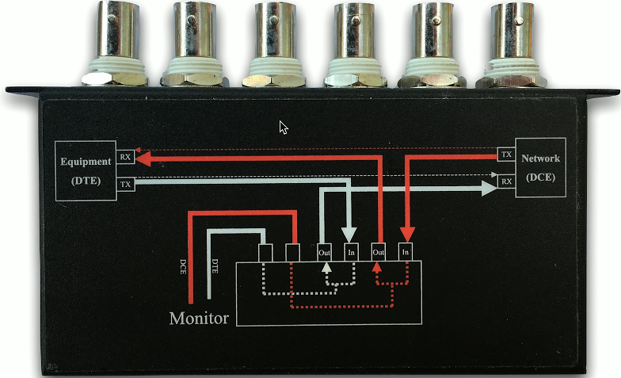

# Hardware Tools 5.5c
## Tone generator
- Where does that wire go?
  - Follow the tong
- Tone generator
  - Puts an analog sound on the wire
- Inductive probe
  - Doesn't need to touch the copper
  - Hear through a small speaker
## Using the tone generator and probe
- Easy wire tracing
  - Even in complex environments 
- Connect the tone generator to the wire
  - Modular jack
  - Coax
  - Punch down connectors
- Use the probe to locate the sound
  - The two-tone sound is easy to find
## Cable testers
- Relatively simple
  - Continuity test
  - A simple wire map
- Can identifiy missing pins
  - Or crossed wires
- Not usually used for frequency testing
  - Crosstalk, signal loss, etc.
## Taps and port mirrors
- Intercept network traffic
  - Send a copy to a packet capture device
- Physical traps
  - Disconnect the link, put a tap in the middle
  - Can be an active or passive tap
- Port mirror
  - Port redirection, SPAN (Switched Port Analyzer)
  - Software-based tap
  - Limited functionality, but can work well in a pinch

## Wireless survey tools
- Signal coverage
- Potential interference
- Built-in tools
- 3rd-party tools

## Wi-Fi analyzer
- Hardware-based Wi-Fi analysis
  - Avoids operating system limitations
  - View all of the 802.11 information in the air
- View Wi-Fi information
  - Frequencies/channels, signal strength, access points, interference, wireless devices
- Get frequency information from a spectrum analyzer
  - Useful when many different devices are part of the bigger picture
  

  

## Visual fault locator

- A flashlight for optical fiber
  - Shine a bright light down the fiber
- Light will show through the fiber jacket where fiber is broken
  - You may need to turn the lights out
- Relatively low-tech
  - But very effective